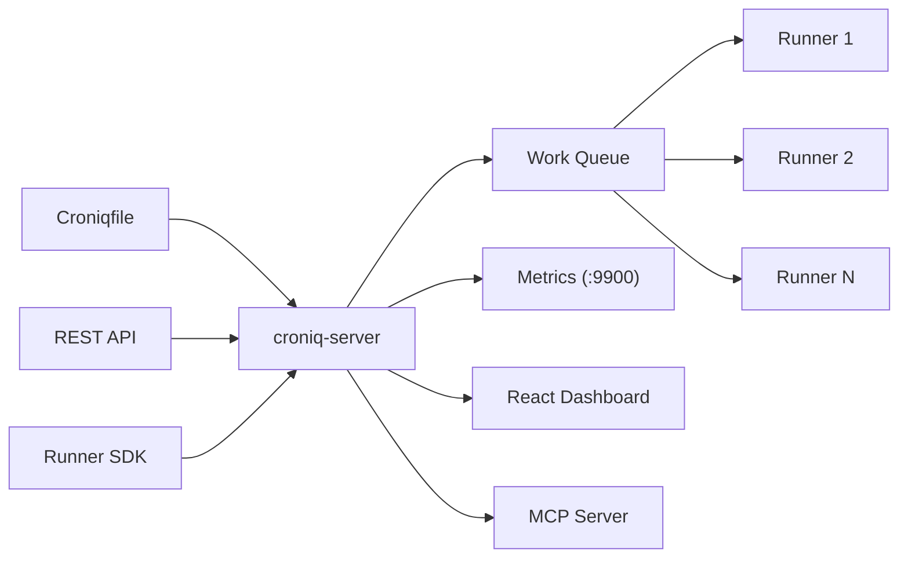

# Croniq

[](https://github.com/nuetzliches/croniq/actions/workflows/ci.yml)
[](LICENSE-MIT)
[](https://ghcr.io/nuetzliches/croniq)
[](openapi.yaml)

**Distributed cron that just works.** Single binary. SQLite default. Production-ready retries.

Reliable distributed job scheduling with built-in retries, calendar-aware scheduling, a React dashboard, and an AI-native MCP server. Deploy as a single binary or Docker container — no cluster required.

Full API documentation: [`openapi.yaml`](openapi.yaml)

---

## Why Croniq?

| Problem | Croniq |
|---|---|
| Cron jobs fail silently — nobody notices for days | Dead letter queue, execution logs, Prometheus metrics, failure notification hooks |
| Single server = single point of failure | Pull-based runner protocol — scale runners independently |
| No retries, no backoff, no timeout | Exponential, linear, fixed retry with jitter. Per-job timeout enforcement |
| Most schedulers need a cluster just to get started | Single binary, SQLite by default, Docker one-liner |
| Timezone and DST edge cases break everything | Per-job timezone, calendar system with business day rules |
| Teams can't self-service their own schedules | Hybrid model: Croniqfile DSL for ops, REST API + Runner SDK for developers |

## Who Is It For?

- **Small-to-mid engineering teams** running 20–200 scheduled jobs without a platform team
- **DevOps/SRE teams** replacing fragile crontabs with something observable
- **Self-hosters** who want a single Docker container with a dashboard

---

## Key Features

**Croniqfile DSL** — human-readable scheduling configuration. Includes parser, compiler, formatter, validator, and crontab migration tool.

**Hybrid job registration** — define jobs in the Croniqfile (infrastructure-as-code) *or* register them dynamically via REST API and Runner SDK. Both coexist; Croniqfile takes precedence on conflicts.

**Pull-based runner protocol** — runners poll for work via HTTP long-poll. Scale runners independently. Built-in capability routing, instance guard, and lease renewal.

**Calendar system** — include/exclude rules for weekdays, holidays, annual dates, and time windows. Jobs fire only when the calendar allows.

**Retry + dead letter** — exponential, linear, or fixed backoff with jitter. Failed executions go to a dead letter queue for inspection and one-click replay.

**Execution modes** — `queued` (default) persists every execution with full retry and restart recovery. `ephemeral` skips persistence for high-frequency fire-and-forget jobs. Configurable per-job or globally in `defaults {}`. Catch-up policies (`all` / `latest` / `none`) control missed-fire behaviour on restart. Queue TTL and per-job depth limits prevent runaway backlogs.

**Auth** — JWT tokens, API keys, and password authentication. Per-scope authorization is enforced on every endpoint: a token must carry the matching scope (e.g. `jobs:write`, `dead-letters:write`, `runners:read`) or the wildcard `admin` scope. See [Scopes](#scopes) below.

**React dashboard** — login, jobs CRUD with live scheduling, runners with status badges, executions with log viewer, dead letter detail panel.

**MCP server** — 31 tools for AI assistant integration. Full CRUD over jobs, schedules, calendars, dead letters; queue observability; live forecast and execution log access — all from Claude, Cursor, or any MCP client. Available over stdio (`croniq-mcp`) or HTTP at `/mcp` on the running server. JWT-scoped: `mcp:read` for any tool, `mcp:write` for the 17 mutation tools; `admin` is a wildcard. Toggle via Croniqfile `mcp { enabled false }`.

**Failure alerts** — declare named channels + rules in the Croniqfile `alerts { … }` block. Each permanent failure (dead-letter or drop) is matched against your rules, throttled per `(rule, job_key)`, and dispatched to the configured channels — with a persistent delivery log. `CRONIQ_ON_FAILURE_CMD` still works for one release as a back-compat shortcut.

---

## Runner SDKs

Build custom job execution runners in your language of choice. Runners poll the Croniq server for work, dispatch handlers, and report outcomes — schedules and policies stay in your Croniqfile.

| Language | Source | Package | Status |
|----------|--------|---------|--------|
| Rust     | [`crates/croniq-runner-sdk`](crates/croniq-runner-sdk) | (bundled with workspace, not published separately yet) | ✅ available |
| .NET (8, 10) | [`sdks/dotnet`](sdks/dotnet) | `Croniq.Runner.Sdk` + `Croniq.Runner.Sdk.OpenTelemetry` (NuGet — pre-release) | ✅ available |
| Python (3.11+) | [`sdks/python`](sdks/python) | `croniq-runner` (PyPI — pre-release) | ✅ available |
| Go (1.22+) | [`sdks/go`](sdks/go) | `github.com/nuetzliches/croniq/sdks/go` + `.../sdks/go/otel` (Go modules) | ✅ available |
| TypeScript / Node.js | [`sdks/typescript`](sdks/typescript) | `@nuetzliches/croniq-runner` (npm — pre-release) | ✅ available |
| Java / Kotlin | [#133](https://github.com/nuetzliches/croniq/issues/133) | Maven Central (planned) | 🛠 planned |

The .NET SDK ships Generic Host (`IHostedService`) integration, options-pattern configuration, server-side cancellation, OpenTelemetry tracing + metrics, streaming structured logs via `System.Threading.Channels`, health checks, and a generic shell-exec decoder for DSL `runner shell { ... }` jobs. See [`sdks/dotnet/README.md`](sdks/dotnet/README.md) for the quickstart.

The Python SDK is `asyncio`-first (`httpx.AsyncClient` + Pydantic v2), supports server-side cancellation, lease renewal, self-registration via `schedule=`, streaming logs over a bounded `asyncio.Queue` with drain-before-ack, and opt-in OpenTelemetry tracing via the `[otel]` extra. See [`sdks/python/README.md`](sdks/python/README.md) for the quickstart.

The Go SDK ships idiomatic `context.Context` propagation, `log/slog` structured logging, server-side cancellation, a bounded-channel streaming `LogWriter`, lease renewal, drain-on-shutdown, persistent runner identity, and an opt-in OpenTelemetry tracing adapter in a sibling module. See [`sdks/go/README.md`](sdks/go/README.md) for the quickstart.

The TypeScript / Node.js SDK is ESM-first, uses native `fetch` and `AbortController`, and ships the same streaming log writer (batch + drain-before-ack) and server-side cancellation semantics as the .NET SDK. See [`sdks/typescript/README.md`](sdks/typescript/README.md) for the quickstart.

### Language-agnostic conformance suite

Every runner SDK — present or future — must pass the same wire-level test bundle at [`sdks/conformance/`](sdks/conformance/). It scripts a mock HTTP server from YAML cases, runs the SDK against it, and asserts the recorded request stream. A new SDK author gets ~12 "definition of done" cases instead of guessing what to test. See [`sdks/conformance/README.md`](sdks/conformance/README.md) for the case format and how to wire up a new language binding.

---

## Quick Start

Pick the install method that fits your environment. All produce the same `croniq-server` / `croniq` binaries.

### Docker Compose (recommended for trying it out)

Full stack — server + two demo runners executing live jobs — in one command:

```sh
git clone https://github.com/nuetzliches/croniq && cd croniq
docker compose up
```

Open **http://localhost:4000**. The demo runners register against [`Croniqfile.demo`](Croniqfile.demo), so you'll see executions, retries, and occasional dead letters streaming in immediately. Tune with `RUNNER_REPLICAS` and `RUNNER_FAIL_RATE` env vars.

### Docker (server only)

```sh
docker run -p 4000:4000 ghcr.io/nuetzliches/croniq:latest
```

On first start a random admin password is generated and printed to the container logs. Set `CRONIQ_ADMIN_PASSWORD` to use a fixed one.

### curl | sh

```sh
curl -fsSL https://raw.githubusercontent.com/nuetzliches/croniq/main/install.sh | sh
```

Detects your OS/arch (Linux/macOS, x64/ARM64), downloads the latest release, installs to `/usr/local/bin`. Override with `INSTALL_DIR` or `CRONIQ_VERSION`.

### Homebrew (macOS / Linux)

```sh
brew install nuetzliches/tap/croniq
```

### From source

```sh
# Zero-to-running in one command (generates a random admin password)
croniq quickstart

# Or step by step (prompts for password):
croniq init --data-dir .data --username admin
croniq-server --config Croniqfile --data-dir .data --ui-dir ui/dist
```

Open **http://localhost:4000** and log in as `admin` with the password shown during init.

### Migrate from crontab

```sh
croniq migrate /etc/crontab -o Croniqfile
```

---

## Configuration

Jobs can be defined in a **Croniqfile** (declarative DSL), via the **REST API**, or through the **Runner SDK**.

### Croniqfile

```
server {
  listen :4000
  data_dir /var/lib/croniq
}

defaults {
  timezone Europe/Vienna
  retry exponential { max_attempts 3; base 2s; cap 30s }
  timeout 5m

  # Execution mode: "queued" (default) persists every execution to DB,
  # enabling retries, dead-letter, and restart recovery.
  # "ephemeral" skips persistence — ideal for high-frequency heartbeat jobs.
  execution_mode queued

  # What to do with missed fires on server restart:
  # "all" (default) — replay everything, "latest" — run once, "none" — skip
  catch_up all

  # Cancel queued executions that have been waiting too long (optional)
  # queue_ttl 1h

  # Max queued executions per job before new fires are skipped (default: 10)
  # max_queue_depth 10
}

calendar business-days {
  include weekly monday tuesday wednesday thursday friday
  exclude annual 01-01 12-25 12-26
}

# Failure alerts (issue #140) — fire per-rule when an execution
# permanently fails (dead-letter or drop). Throttled per (rule, job)
# so a job that loops failing doesn't flood the channel. Shell,
# webhook, and email channels all ship today.
alerts {
  channel "ops-paging" {
    shell "/usr/local/bin/page-oncall.sh"
  }
  channel "slack" {
    webhook https://hooks.slack.com/services/xxx/yyy/zzz
    sign hmac {env.SLACK_SIGNING_SECRET}
    timeout 5s
  }
  channel "ops-mail" {
    # One address per arg, multiple addresses get one mail each.
    # Needs CRONIQ_SMTP_URL + CRONIQ_SMTP_FROM (server built with
    # --features smtp); otherwise NoopSender just logs the recipient.
    email "ops@example.com" "oncall@example.com"
  }
  rule "billing-fail" {
    when job_failed
    job_key "billing:*"
    min_attempts 2     # fire only after retry exhaustion
    throttle 10m       # one alert per (rule, job_key) per window
    channels "ops-paging" "slack" "ops-mail"
  }
}

job billing:invoice {
  every weekday at 02:00 { calendar business-days }
  runner { require billing }
  timeout 15m
}

job etl:sync {
  every 15 minutes
}

# High-frequency monitoring job — fire-and-forget, no DB overhead
job infra:heartbeat {
  ephemeral every 5 seconds
}
```

### REST API

```sh
# Register a job + schedule via API (immediately live in scheduler)
curl -X POST http://localhost:4000/v1/jobs/register \
  -H "Authorization: ApiKey croniq_..." \
  -H "Content-Type: application/json" \
  -d '{"job_key": "etl:sync", "schedule": "5m", "timeout": "10m"}'
```

### Runner SDK

```rust
use croniq_runner_sdk::{CroniqRunner, ExecutionContext};

#[tokio::main]
async fn main() {
    let runner = CroniqRunner::builder("http://localhost:4000", "my-runner")
        .api_key("croniq_abc123")
        .capabilities(vec!["billing".into()])
        .max_inflight(5)
        .build();

    // Register handler + schedule — auto-registered on the server at startup
    runner.register_with_schedule("billing:invoice", "5m", |ctx: ExecutionContext| async move {
        println!("Processing: {}", ctx.execution_id);
        Ok(())
    }).await;

    runner.start().await.unwrap();
}
```

---

## Generic shell runner

For "run this command on a schedule" use-cases you don't need to write Rust at
all. The `croniq-shell-runner` binary (shipped in the same Docker image)
executes any job whose Croniqfile carries a `runner shell { … }` or
`runner exec { … }` block.

```croniqfile
job ops:db-dump {
  every day at 03:00
  runner { require shell-runner }
  runner shell {
    command "pg_dump -U app app > /backups/app-$(date +%F).sql"
    workdir /opt
    env { PGPASSWORD {env.PGPASSWORD} }
  }
  timeout 10m
  retry exponential { max_attempts 3 }
}

# argv form — no shell, no quoting hazards
job ops:logrotate {
  every 1 hour
  runner exec { args /usr/sbin/logrotate /etc/logrotate.conf }
}
```

The runner advertises the `shell-runner` capability and matches the standard
`runner { require shell-runner }` placement constraint, so you can keep
sensitive shell-runner pools separate from your custom-Rust runners.

```yaml
# docker-compose.yml — additional service
shell-runner:
  image: ghcr.io/nuetzliches/croniq:latest
  entrypoint: ["croniq-shell-runner"]
  environment:
    CRONIQ_SERVER_URL: http://server:4000
    CRONIQ_API_KEY: croniq_…
    RUNNER_MAX_INFLIGHT: "4"
  volumes:
    # Persistent runner identity. Without this, every container recreate
    # generates a new runner_id and the Runner Detail Sheet's history
    # disappears. Set RUNNER_ID explicitly to override the auto-generated
    # ID for human-readable names (e.g. RUNNER_ID=shell-runner-vps-prod).
    - shell-runner-state:/var/lib/croniq-runner
    - /opt:/opt
    - /backups:/backups
```

**Trust model.** Anyone with write access to the Croniqfile (or to
`__runner_exec` job metadata via the API) can run arbitrary commands as the
shell-runner process. Treat the runner pool's filesystem and network as
exposed to whoever can ship a Croniqfile change. Run separate shell-runner
pools per blast-radius bracket and use `runner { require <pool> }` /
`exclude <pool>` to pin sensitive jobs to the right pool.

**Webhook delivery for failure alerts** — the `alerts { channel "…" { webhook … } }`
DSL (issue #140 PR-2) sends an HMAC-signed JSON envelope to the configured URL on
every matching permanent failure:

```jsonc
POST <channel.webhook>
Content-Type: application/json
X-Croniq-Event: alerts.fired
X-Croniq-Delivery-Id: <uuid>
X-Croniq-Signature: sha256=<hex(hmac-sha256(secret, raw_body))>

{
  "rule":           "billing-fail",
  "event":          "job_failed",
  "job_key":        "billing:invoice",
  "execution_id":   "…",
  "attempt":        3,
  "reason":         "dead_letter",       // or "dropped"
  "error":          "runner exited 1: connection refused",
  "fired_at":       "2026-05-25T08:12:00Z",
  "croniq_version": "0.4.2"
}
```

The envelope is a stable contract; future versions only add fields. To verify
a receiver, recompute `sha256=hex(hmac_sha256(secret, raw_body))` and
constant-time-compare against `X-Croniq-Signature`. One retry on 5xx /
network error with a 3-second backoff before recording `delivery_failed`;
4xx responses are recorded immediately without retry.

**Webhook delivery from a job** (different concern — outbound trigger of a
business action) is not yet a first-class `runner http` mode. Use
`runner shell { command "curl -X POST … " }` for that today.

---

## Architecture



### Crates

| Crate | Description |
|---|---|
| `croniq-config` | DSL parser, compiler, formatter, validator |
| `croniq-scheduler` | Cron engine, calendar evaluation, trigger state machine |
| `croniq-store` | Persistence traits + SQLite / Postgres |
| `croniq-execution` | Retry, timeout, dead-letter pipeline |
| `croniq-runner` | HTTP Pull-API server, registry, work queue |
| `croniq-bridge` | JobConfig to WorkItem translation |
| `croniq-auth` | JWT, API key hashing, password auth |
| `croniq-server` | HTTP server with ~35 REST endpoints |
| `croniq-mcp` | MCP server for AI assistants |
| `croniq-cli` | CLI: validate, fmt, compile, init, migrate, quickstart |
| `croniq-runner-sdk` | Client library for building runners |
| `croniq-demo-runner` | Ready-made runner binary used by the Docker Compose quickstart |
| `croniq-shell-runner` | Generic runner that executes `runner shell { … }` / `runner exec { … }` jobs as subprocesses |

---

## REST API

All `/v1/` endpoints require authentication (`Authorization: Bearer <jwt>` or `Authorization: ApiKey <key>`).

| Group | Endpoints |
|---|---|
| Auth | `POST /v1/auth/login`, `/refresh`, `/logout` |
| Jobs | `GET/POST /v1/jobs`, `GET/DELETE /v1/jobs/{key}`, `POST .../activate`, `POST /v1/jobs/register` |
| Schedules | `GET/POST /v1/schedules`, `GET/DELETE /v1/schedules/{id}` |
| Runners | `GET /v1/runners`, `GET /v1/runners/stream` (SSE), `DELETE /v1/runners/{id}` |
| Work | `POST /v1/work/poll`, `/ack`, `/renew`, `/{id}/events` |
| Executions | `GET /v1/executions`, `GET /v1/executions/{id}/logs` |
| Dead Letters | `GET /v1/dead-letters`, `GET/DELETE .../dead-letters/{id}`, `POST .../replay` |
| Calendars | `GET/POST /v1/calendars`, `GET/DELETE /v1/calendars/{id}` |
| Dashboard | `GET /v1/dashboard/forecast` |
| API Clients | `GET/POST /v1/api-clients`, `DELETE .../api-clients/{id}`, `POST .../tokens` |
| API Keys | `POST /v1/api-keys`, `DELETE /v1/api-keys/{id}` |
| Health | `GET /health` (public) |
| Metrics | `GET /metrics` (separate port) |

Full specification: [`openapi.yaml`](openapi.yaml)

### Scopes

Every endpoint requires the matching scope on the caller's token. `admin` acts as a wildcard. The CLI's `croniq init` issues an admin client by default; for production runners and dashboards, mint API keys with the minimum scope set.

| Endpoint group | Read scope | Write scope |
|---|---|---|
| Jobs | `jobs:read` | `jobs:write` (`jobs:register` for `/v1/jobs/register`, `jobs:trigger` for `/v1/trigger`) |
| Schedules | `schedules:read` | `schedules:write` |
| Calendars | `calendars:read` | `calendars:write` |
| Executions + logs | `executions:read` | — |
| Dead letters | `dead-letters:read` | `dead-letters:write` (delete + replay) |
| Runners | `runners:read` (incl. SSE) | `runners:write` |
| Runner pull-protocol | — | `work:poll`, `work:ack`, `work:renew`, `work:events` |
| Dashboard forecast | `jobs:read` | — |
| API clients | `api-clients:admin` | `api-clients:admin` |
| API keys | — | `api-keys:admin` |
| Admin reload | — | `admin` |

A 403 with no body is returned when the scope is missing. Auth-disabled mode (no `pull_api.auth` and no `CRONIQ_JWT_SECRET`) injects a synthetic admin context so unconfigured dev servers stay open — production must configure JWT or refuse to start.

---

## Observability

Beyond the Prometheus `/metrics` endpoint, Croniq can ship scheduler **traces and logs** to any OTLP-speaking collector — Aspire Dashboard, OTel-Collector, Grafana Tempo/Loki, etc. The OTLP exporter is **compiled into the official Docker image and release binaries**; activation stays opt-in at runtime via a single env var.

### Official artefacts ship with OTLP compiled in

Since v0.14.0, `ghcr.io/nuetzliches/croniq:latest`, the per-target `croniq-*.tar.gz` archives, and the Homebrew formula are all built with `--features croniq-server/otlp`. With `OTEL_EXPORTER_OTLP_ENDPOINT` unset, behaviour is identical to a no-feature build — the runtime gate in [`telemetry.rs::decide`](crates/croniq-server/src/telemetry.rs) only installs the OTLP layer when the endpoint is set and non-empty.

### Build from source

The Cargo default stays off so a plain `cargo build` from a checkout does not pull the opentelemetry stack. Pass the flag explicitly to match the shipped artefacts:

```sh
# from source — single crate install
cargo install --path crates/croniq-server --features otlp
# or in a workspace build
cargo build --workspace --features croniq-server/otlp
```

### Configure at runtime

Croniq reads the standard W3C / OpenTelemetry environment variables — no Croniqfile changes needed:

| Env var | Default | Effect |
|---|---|---|
| `OTEL_EXPORTER_OTLP_ENDPOINT` | *(unset)* | If set, install OTLP span + log exporters in parallel with stderr logs. If unset, behaviour is identical to today. |
| `OTEL_EXPORTER_OTLP_PROTOCOL` | `grpc` | `grpc` (port 4317) or `http/protobuf` / `http/json` (port 4318). Both transports are compiled into the `otlp` feature. |
| `OTEL_SERVICE_NAME` | `croniq` | Service identity attached to every span / log record. |
| `OTEL_RESOURCE_ATTRIBUTES` | *(empty)* | Free-form `key1=val1,key2=val2` extra attributes (e.g. `deployment.environment=prod,host.name=ops01`). |
| `OTEL_LOG_LEVEL` | `info` | EnvFilter directive used as a per-OTLP filter so `RUST_LOG=trace` does not flood the collector. |

Example — point at a local OTel-Collector:

```sh
OTEL_EXPORTER_OTLP_ENDPOINT=http://localhost:4317 \
OTEL_SERVICE_NAME=croniq-prod \
croniq-server --config Croniqfile
```

Example — alongside a .NET Aspire stack:

```yaml
# docker-compose.yml (additions to the server service)
services:
  server:
    environment:
      OTEL_EXPORTER_OTLP_ENDPOINT: http://aspire-dashboard:18889
      OTEL_RESOURCE_ATTRIBUTES: deployment.environment=staging
```

### What gets exported

- **Spans** — `scheduler.tick` per scheduler tick (every second), `CompletionProcessor::process` per completion event. Existing trigger-fire events and execution-queued events become span events under the parent tick span.
- **Logs** — every `tracing::info!` / `warn!` / `error!` emitted by croniq-server is also sent as an OTLP log record. The stderr `fmt` layer remains in parallel so local logs still work.

### Security note

Croniq's events include public identifiers — `job_key`, `runner_id`, `execution_id`, request paths. These are not credentials (the same identifiers appear in every PollRequest, ack, log row, and UI display) and are exported by design. CodeQL's `rust/cleartext-logging` heuristic flags them; see [`AGENTS.md`](AGENTS.md) for the project's standing dismissal of that pattern. Genuine credentials (API keys, JWT secrets, passwords) are never logged or exported.

### Out of scope (deferred)

- **OTLP metrics** — the Prometheus `/metrics` endpoint stays the metrics path. OTLP-push metrics is tracked separately.
- **Trace propagation runner ↔ server** — runners do not yet accept/forward a W3C `traceparent`, so the trace ends at the server's enqueue. Tracked separately.

---

## DSL vs. API: Source of Truth

Resources can come from two places: the **Croniqfile** (declarative, in-file source of truth) or the **API/UI** (mutable, persisted in SQLite). Both surfaces are unified at read time:

- `GET /v1/jobs`, `GET /v1/schedules`, `GET /v1/calendars` return the union, tagged with `managed_by: "dsl"` or `"api"`.
- The UI shows a `dsl` badge on Croniqfile-managed rows; their edit/delete buttons are disabled.

By default, mutations on `managed_by: "dsl"` rows return **409 Conflict** — the Croniqfile owns them, and an API edit would silently revert on the next reload. The error body includes the `adopt` URL and the policy flag needed to enable it.

### Adoption (opt-in)

Set `policy { dsl_adopt_on_mutate true }` in the Croniqfile to allow taking ownership of a DSL-managed resource through the API:

```sh
# Calendars: synthetic ID is dsl:{name}
curl -X POST http://localhost:4000/v1/calendars/dsl:business-days/adopt \
  -H "Authorization: Bearer $TOKEN"

# Jobs: identified by job_key
curl -X POST http://localhost:4000/v1/jobs/billing:invoice/adopt \
  -H "Authorization: Bearer $TOKEN"
```

Adopt copies the resource into the persistent store with a fresh UUID and `managed_by="api"`, and records the adoption in `dsl_adoptions` so the loader skips that key on subsequent reloads. The resource is then editable via the standard PUT/DELETE endpoints. Reversible via `POST .../unadopt` — the next reload reinstates the Croniqfile definition.

The flag is server-wide and default-off: existing deployments see no behaviour change. Adoption requires the `calendars:write` or `jobs:write` scope; no separate scope is needed.

See `openapi.yaml` for the full request/response schema.

---

## CLI

```sh
croniq quickstart                          # Zero-to-running: init + sample Croniqfile
croniq init --data-dir .data               # Seed admin user (add --api-key to also seed a default client)
croniq validate Croniqfile                 # Check for errors
croniq fmt Croniqfile --write              # Format in place
croniq compile Croniqfile                  # Print compiled JSON
croniq convert '*/15 * * * *'             # Cron expression to DSL
croniq migrate crontab.txt -o Croniqfile   # Convert crontab to Croniqfile
croniq status                              # Live scheduler status
croniq list-runners                        # Connected runners
croniq trigger billing:invoice             # Fire job immediately
croniq dead-letters --data-dir .           # List dead letters
```

## Environment Variables

| Variable | Description | Default |
|---|---|---|
| `RUST_LOG` | Log level filter | `info` |
| `CRONIQ_JWT_SECRET` | JWT signing secret | random per-start |
| `CRONIQ_ADMIN_USER` | Docker auto-init username | `admin` |
| `CRONIQ_ADMIN_PASSWORD` | Docker auto-init password (random if unset) | _generated_ |
| `CRONIQ_INIT_API_KEY` | Seed a default admin API client on first run. Must start with `croniq_` (e.g. `croniq_$(openssl rand -hex 32)`). Fails fast on first run if the prefix is missing. | — |
| `CRONIQ_ON_FAILURE_CMD` | **Deprecated** — single global shell command on permanent failure. At boot, croniq-server synthesises a catch-all rule from this var when no `alerts {}` block is present. Migrate to `alerts { channel "…" { shell "…" } rule "…" { when job_failed; channels "…" } }` and unset. | — |
| `CRONIQ_ENV` | Deployment label surfaced by `GET /version` (and rendered as an env badge in the UI). See [`docs/operations.md`](docs/operations.md). | `unknown` |

---

## Documentation

| Document | Purpose |
|---|---|
| [`README.md`](README.md) | This file — overview, quick start, architecture |
| [`openapi.yaml`](openapi.yaml) | OpenAPI 3.1 specification for all REST endpoints |
| [`docs/operations.md`](docs/operations.md) | Operational notes: public endpoints, environment variables |
| [`Croniqfile.example`](Croniqfile.example) | Full DSL example with calendars, retries, metadata |
| [`Croniqfile.demo`](Croniqfile.demo) | Minimal demo profile used by `docker compose up` |
| [`docker-compose.yml`](docker-compose.yml) | Quickstart stack: server + demo runners |
| [`install.sh`](install.sh) | `curl \| sh` installer for Linux/macOS |
| [`AGENTS.md`](AGENTS.md) | AI assistant guidance for contributing |
| [`crates/croniq-runner-sdk/examples/`](crates/croniq-runner-sdk/examples/) | Runner SDK usage examples |

---

## Development

```sh
cargo build --workspace              # Build all crates
cargo test --workspace               # Run all tests
cargo clippy --workspace -- -D warnings  # Lint

cd ui && npm run dev                 # Vite dev server on :5173
croniq-server --config Croniqfile.example --data-dir .data  # API on :4000
```

## License

Licensed under either of

- Apache License, Version 2.0 ([LICENSE-APACHE](LICENSE-APACHE) or http://www.apache.org/licenses/LICENSE-2.0)
- MIT License ([LICENSE-MIT](LICENSE-MIT) or http://opensource.org/licenses/MIT)

at your option.
