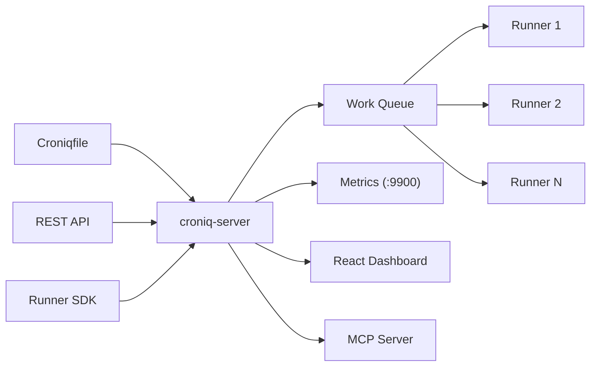

# Croniq

[](https://github.com/nuetzliches/croniq/actions/workflows/ci.yml)
[](LICENSE-MIT)
[](https://ghcr.io/nuetzliches/croniq)
[](openapi.yaml)

**Distributed cron that just works.** Single binary. SQLite default. Production-ready retries.

Reliable distributed job scheduling with built-in retries, calendar-aware scheduling, a React dashboard, and an AI-native MCP server. Deploy as a single binary or Docker container — no cluster required.

Full API documentation: [`openapi.yaml`](openapi.yaml)

---

## Why Croniq?

| Problem | Croniq |
|---|---|
| Cron jobs fail silently — nobody notices for days | Dead letter queue, execution logs, Prometheus metrics, failure notification hooks |
| Single server = single point of failure | Pull-based runner protocol — scale runners independently |
| No retries, no backoff, no timeout | Exponential, linear, fixed retry with jitter. Per-job timeout enforcement |
| Most schedulers need a cluster just to get started | Single binary, SQLite by default, Docker one-liner |
| Timezone and DST edge cases break everything | Per-job timezone, calendar system with business day rules |
| Teams can't self-service their own schedules | Hybrid model: Croniqfile DSL for ops, REST API + Runner SDK for developers |

## Who Is It For?

- **Small-to-mid engineering teams** running 20–200 scheduled jobs without a platform team
- **DevOps/SRE teams** replacing fragile crontabs with something observable
- **Self-hosters** who want a single Docker container with a dashboard

---

## Key Features

**Croniqfile DSL** — human-readable scheduling configuration. Includes parser, compiler, formatter, validator, and crontab migration tool.

**Hybrid job registration** — define jobs in the Croniqfile (infrastructure-as-code) *or* register them dynamically via REST API and Runner SDK. Both coexist; Croniqfile takes precedence on conflicts.

**Pull-based runner protocol** — runners poll for work via HTTP long-poll. Scale runners independently. Built-in capability routing, instance guard, and lease renewal.

**Calendar system** — include/exclude rules for weekdays, holidays, annual dates, and time windows. Jobs fire only when the calendar allows.

**Retry + dead letter** — exponential, linear, or fixed backoff with jitter. Failed executions go to a dead letter queue for inspection and one-click replay.

**Execution modes** — `queued` (default) persists every execution with full retry and restart recovery. `ephemeral` skips persistence for high-frequency fire-and-forget jobs. Configurable per-job or globally in `defaults {}`. Catch-up policies (`all` / `latest` / `none`) control missed-fire behaviour on restart. Queue TTL and per-job depth limits prevent runaway backlogs.

**Auth** — JWT tokens, API keys, and password authentication. Per-scope authorization (jobs:read, runners:write, admin, etc.).

**React dashboard** — login, jobs CRUD with live scheduling, runners with status badges, executions with log viewer, dead letter detail panel.

**MCP server** — 12 tools for AI assistant integration. Observe queue status, list runners, trigger jobs, manage dead letters — all from Claude, Cursor, or any MCP client.

**Failure notifications** — `CRONIQ_ON_FAILURE_CMD` runs a shell command when executions fail. Pipe to Slack, PagerDuty, or any webhook endpoint.

---

## Quick Start

Pick the install method that fits your environment. All produce the same `croniq-server` / `croniq` binaries.

### Docker Compose (recommended for trying it out)

Full stack — server + two demo runners executing live jobs — in one command:

```sh
git clone https://github.com/nuetzliches/croniq && cd croniq
docker compose up
```

Open **http://localhost:4000**. The demo runners register against [`Croniqfile.demo`](Croniqfile.demo), so you'll see executions, retries, and occasional dead letters streaming in immediately. Tune with `RUNNER_REPLICAS` and `RUNNER_FAIL_RATE` env vars.

### Docker (server only)

```sh
docker run -p 4000:4000 ghcr.io/nuetzliches/croniq:latest
```

On first start a random admin password is generated and printed to the container logs. Set `CRONIQ_ADMIN_PASSWORD` to use a fixed one.

### curl | sh

```sh
curl -fsSL https://raw.githubusercontent.com/nuetzliches/croniq/main/install.sh | sh
```

Detects your OS/arch (Linux/macOS, x64/ARM64), downloads the latest release, installs to `/usr/local/bin`. Override with `INSTALL_DIR` or `CRONIQ_VERSION`.

### Homebrew (macOS / Linux)

```sh
brew install nuetzliches/tap/croniq
```

### From source

```sh
# Zero-to-running in one command (generates a random admin password)
croniq quickstart

# Or step by step (prompts for password):
croniq init --data-dir .data --username admin
croniq-server --config Croniqfile --data-dir .data --ui-dir ui/dist
```

Open **http://localhost:4000** and log in as `admin` with the password shown during init.

### Migrate from crontab

```sh
croniq migrate /etc/crontab -o Croniqfile
```

---

## Configuration

Jobs can be defined in a **Croniqfile** (declarative DSL), via the **REST API**, or through the **Runner SDK**.

### Croniqfile

```
server {
  listen :4000
  data_dir /var/lib/croniq
}

defaults {
  timezone Europe/Vienna
  retry exponential { max_attempts 3; base 2s; cap 30s }
  timeout 5m

  # Execution mode: "queued" (default) persists every execution to DB,
  # enabling retries, dead-letter, and restart recovery.
  # "ephemeral" skips persistence — ideal for high-frequency heartbeat jobs.
  execution_mode queued

  # What to do with missed fires on server restart:
  # "all" (default) — replay everything, "latest" — run once, "none" — skip
  catch_up all

  # Cancel queued executions that have been waiting too long (optional)
  # queue_ttl 1h

  # Max queued executions per job before new fires are skipped (default: 10)
  # max_queue_depth 10
}

calendar business-days {
  include weekly monday tuesday wednesday thursday friday
  exclude annual 01-01 12-25 12-26
}

job billing:invoice {
  every weekday at 02:00 { calendar business-days }
  runner { require billing }
  timeout 15m
}

job etl:sync {
  every 15 minutes
}

# High-frequency monitoring job — fire-and-forget, no DB overhead
job infra:heartbeat {
  ephemeral every 5 seconds
}
```

### REST API

```sh
# Register a job + schedule via API (immediately live in scheduler)
curl -X POST http://localhost:4000/v1/jobs/register \
  -H "Authorization: ApiKey croniq_..." \
  -H "Content-Type: application/json" \
  -d '{"job_key": "etl:sync", "schedule": "5m", "timeout": "10m"}'
```

### Runner SDK

```rust
use croniq_runner_sdk::{CroniqRunner, ExecutionContext};

#[tokio::main]
async fn main() {
    let runner = CroniqRunner::builder("http://localhost:4000", "my-runner")
        .api_key("croniq_abc123")
        .capabilities(vec!["billing".into()])
        .max_inflight(5)
        .build();

    // Register handler + schedule — auto-registered on the server at startup
    runner.register_with_schedule("billing:invoice", "5m", |ctx: ExecutionContext| async move {
        println!("Processing: {}", ctx.execution_id);
        Ok(())
    }).await;

    runner.start().await.unwrap();
}
```

---

## Architecture



### Crates

| Crate | Description |
|---|---|
| `croniq-config` | DSL parser, compiler, formatter, validator |
| `croniq-scheduler` | Cron engine, calendar evaluation, trigger state machine |
| `croniq-store` | Persistence traits + SQLite / Postgres |
| `croniq-execution` | Retry, timeout, dead-letter pipeline |
| `croniq-runner` | HTTP Pull-API server, registry, work queue |
| `croniq-bridge` | JobConfig to WorkItem translation |
| `croniq-auth` | JWT, API key hashing, password auth |
| `croniq-server` | HTTP server with ~35 REST endpoints |
| `croniq-mcp` | MCP server for AI assistants |
| `croniq-cli` | CLI: validate, fmt, compile, init, migrate, quickstart |
| `croniq-runner-sdk` | Client library for building runners |
| `croniq-demo-runner` | Ready-made runner binary used by the Docker Compose quickstart |

---

## REST API

All `/v1/` endpoints require authentication (`Authorization: Bearer <jwt>` or `Authorization: ApiKey <key>`).

| Group | Endpoints |
|---|---|
| Auth | `POST /v1/auth/login`, `/refresh`, `/logout` |
| Jobs | `GET/POST /v1/jobs`, `GET/DELETE /v1/jobs/{key}`, `POST .../activate`, `POST /v1/jobs/register` |
| Schedules | `GET/POST /v1/schedules`, `GET/DELETE /v1/schedules/{id}` |
| Runners | `GET /v1/runners`, `GET /v1/runners/stream` (SSE), `DELETE /v1/runners/{id}` |
| Work | `POST /v1/work/poll`, `/ack`, `/renew`, `/{id}/events` |
| Executions | `GET /v1/executions`, `GET /v1/executions/{id}/logs` |
| Dead Letters | `GET /v1/dead-letters`, `GET/DELETE .../dead-letters/{id}`, `POST .../replay` |
| Calendars | `GET/POST /v1/calendars`, `GET/DELETE /v1/calendars/{id}` |
| Dashboard | `GET /v1/dashboard/forecast` |
| API Clients | `GET/POST /v1/api-clients`, `DELETE .../api-clients/{id}`, `POST .../tokens` |
| API Keys | `POST /v1/api-keys`, `DELETE /v1/api-keys/{id}` |
| Health | `GET /health` (public) |
| Metrics | `GET /metrics` (separate port) |

Full specification: [`openapi.yaml`](openapi.yaml)

---

## CLI

```sh
croniq quickstart                          # Zero-to-running: init + sample Croniqfile
croniq init --data-dir .data               # Seed admin user + API key
croniq validate Croniqfile                 # Check for errors
croniq fmt Croniqfile --write              # Format in place
croniq compile Croniqfile                  # Print compiled JSON
croniq convert '*/15 * * * *'             # Cron expression to DSL
croniq migrate crontab.txt -o Croniqfile   # Convert crontab to Croniqfile
croniq status                              # Live scheduler status
croniq list-runners                        # Connected runners
croniq trigger billing:invoice             # Fire job immediately
croniq dead-letters --data-dir .           # List dead letters
```

## Environment Variables

| Variable | Description | Default |
|---|---|---|
| `RUST_LOG` | Log level filter | `info` |
| `CRONIQ_JWT_SECRET` | JWT signing secret | random per-start |
| `CRONIQ_ADMIN_USER` | Docker auto-init username | `admin` |
| `CRONIQ_ADMIN_PASSWORD` | Docker auto-init password (random if unset) | _generated_ |
| `CRONIQ_ON_FAILURE_CMD` | Shell command on execution failure | — |

---

## Documentation

| Document | Purpose |
|---|---|
| [`README.md`](README.md) | This file — overview, quick start, architecture |
| [`openapi.yaml`](openapi.yaml) | OpenAPI 3.1 specification for all REST endpoints |
| [`Croniqfile.example`](Croniqfile.example) | Full DSL example with calendars, retries, metadata |
| [`Croniqfile.demo`](Croniqfile.demo) | Minimal demo profile used by `docker compose up` |
| [`docker-compose.yml`](docker-compose.yml) | Quickstart stack: server + demo runners |
| [`install.sh`](install.sh) | `curl \| sh` installer for Linux/macOS |
| [`Formula/croniq.rb`](Formula/croniq.rb) | Homebrew formula (synced to `nuetzliches/homebrew-tap` on release) |
| [`AGENTS.md`](AGENTS.md) | AI assistant guidance for contributing |
| [`crates/croniq-runner-sdk/examples/`](crates/croniq-runner-sdk/examples/) | Runner SDK usage examples |

---

## Development

```sh
cargo build --workspace              # Build all crates
cargo test --workspace               # Run all tests
cargo clippy --workspace -- -D warnings  # Lint

cd ui && npm run dev                 # Vite dev server on :5173
croniq-server --config Croniqfile.example --data-dir .data  # API on :4000
```

## License

Licensed under either of

- Apache License, Version 2.0 ([LICENSE-APACHE](LICENSE-APACHE) or http://www.apache.org/licenses/LICENSE-2.0)
- MIT License ([LICENSE-MIT](LICENSE-MIT) or http://opensource.org/licenses/MIT)

at your option.
