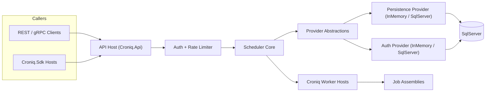

# Croniq Architecture

This document captures the current architecture of Croniq and replaces the earlier concept drafts. It records the validated design choices, service layout, and quality targets that already shape the codebase.

## Product Goals & SLOs

- Provide a modular .NET 10 scheduling platform with a light in-memory execution path, extensible providers, and durable persistence when required.
- Match the feature coverage of established schedulers while lowering boot time and simplifying auth/policy setup.
- Default SLOs:
  - Trigger lookup + schedule evaluation: < 100 ms p50 / < 250 ms p95 for up to 10k active triggers per node.
  - End-to-end job start (trigger to `ExecuteAsync`): < 500 ms p95 (in-memory), < 750 ms p95 (SqlServer persistence).
  - Availability: 99.9% monthly for Scheduler/API; API error rate < 0.1% per day; clock drift between nodes < 50 ms.

## Layered Architecture

| Layer                                                                          | Responsibilities                                                                             |
| ------------------------------------------------------------------------------ | -------------------------------------------------------------------------------------------- |
| Scheduler Core (`Croniq.Core`)                                                 | Trigger parsing, schedule evaluation, policies, execution pipeline, `IJob` contracts.        |
| Provider Layer (`Croniq.Persistence.*`, `Croniq.Auth.*`, `Croniq.Providers.*`) | Abstractions and default implementations for persistence, auth, logging, telemetry, secrets. |
| Service Layer (`Croniq.Api`, RPC)                                              | Minimal API endpoints, rate limiting, auth middleware, gRPC/JSON-RPC endpoints.              |
| Jobs Layer (`Croniq.Sdk`, sample job projects)                                 | Authoring model for jobs, DI helpers, samples.                                               |
| Infrastructure (`infra/docker`, `tools/Croniq.DbMigrator`)                     | Docker Compose dev stack, EF Core migrations, helper scripts, future UI.                     |

Hosting extensions (`AddCroniqApiServices`, `AddCroniqApiRateLimiter`, `UseCroniqApi`) wire the pieces together. Auth and persistence can run in `InMemory` or `SqlServer` modes via configuration (`Croniq:*`).

## System Diagram



## Repository & Documentation Layout

```text
src/
  Croniq.Core/
  Croniq.JobStore.InMemory/
  Croniq.Persistence.Abstractions/
  Croniq.Persistence.SqlServer/
  Croniq.Auth.Abstractions/
  Croniq.Auth.Core/
  Croniq.Auth.SqlServer/
  Croniq.Data.SqlServer/
  Croniq.Api/
  Croniq.Rpc.Client/
  Croniq.Sdk/
  ...
docs/
  introduction/
  guides/
  ops/
  deep-dive/
```

- `Croniq.Data.SqlServer` centralises EF Core entities, DbContext, and migrations for both persistence and auth.
- `docs` is split into consumer-focused introductions/guides and the deep-dive stream (this document, security, observability, etc.).
- Architecture diagrams now live inline as Mermaid blocks inside this document so they render everywhere without external tooling.

## Persistence & Auth

- SqlServer is the canonical durable store. All entities live in schema `croniq` with `TenantId`, `EnvironmentTag`, and row metadata.
- `Croniq.Persistence.SqlServer` implements `IJobPersistenceProvider`, handling jobs, triggers, leases, and dead letters. The CLI `tools/Croniq.DbMigrator` applies migrations.
- Auth shares the same DbContext. `Croniq.Auth.SqlServer` stores API clients/keys (hashed secrets with per-key salt); `Croniq.Auth.Core` offers the in-memory fallback for samples/tests.
- Config:
  - `Croniq:Auth:Mode = InMemory|SqlServer`; overrides under `Croniq:Auth:SqlServer:*`.
  - `Croniq:Persistence:Mode = InMemory|SqlServer`; overrides under `Croniq:Persistence:SqlServer:*`.
  - Shared connection string at `Croniq:SqlServer:ConnectionString` unless overridden.
- API key flow (header `X-Croniq-Key`) is the default. Bearer-token flow feeds the same `ICallerContext` abstraction. Rate limiting partitions on `TenantId:CallerId`.

## Scheduler & Execution Semantics

- Trigger types: Cron-compatible expressions (7 fields), fixed/sliding intervals, calendar windows, ad-hoc/event driven.
- Every job key follows `TenantId:EnvironmentTag:Namespace:JobName[:Variant]`, ensuring partitioning across tenants/environments.
- `IJobExecutionContext` exposes metadata, logger, telemetry hooks, and helpers (`InitProgress`, `ReportProgress`, `CustomState`). Jobs log and rethrow exceptions so policies can respond.
- Misfires are retried while `MaxMisfireDelay` (default 5 minutes) is respected. Beyond that the execution is marked as dead letter.
- Delivery semantics: at-least-once by default. Callers may supply `IdempotencyKey` metadata to deduplicate downstream effects.

### Lease Renewal & Long-Running Jobs

- Each trigger execution is protected by a lease (`Croniq:Persistence:SqlServer:LeaseDurationSeconds` or `Croniq:JobStore:InMemory:LeaseDurationSeconds`, default 60s).
- While a job runs, the worker renews the lease ahead of expiry (`Croniq:WorkerHost:LeaseRenewalLeadTime`, default 10s). Setting this to `00:00:00` disables renewals.
- If renewal fails, the worker cancels the execution and skips releasing the lease to avoid clobbering a new owner; once the lease expires the trigger can be reacquired.
- If renewals are disabled or a lease is lost, another worker may pick up the same trigger while the original handler is still running, so long-running jobs must remain idempotent.
- Keep execution timeouts aligned: `Croniq:Policies:Execution:Timeout:Timeout` defaults to 5 minutes and should remain higher than the lease duration. For long-running jobs, increase/disable the timeout and ensure `LeaseRenewalLeadTime` is comfortably smaller than the lease (e.g., 10s lead on a 60s lease).

## Job Store & Provider Model

- In-memory JobStore (`Croniq.JobStore.InMemory`) stays the default for dev/test while all operations flow through `IJobPersistenceProvider` contracts.
- SqlServer provider adds durability, leases, recovery, and future clustering. Locking uses SQL row versions and optional lease tables.
- Providers also exist for auth, logging (Serilog), telemetry (OpenTelemetry), secrets, and future extensions (queues, notifications).
- All persistence access goes through EF Core. Schema changes use migrations (`dotnet ef migrations add ...` in `Croniq.Data.SqlServer`). CI verifies drift via `Croniq.DbMigrator --verify`.

## API & RPC Surface

- Minimal API endpoints: `POST /jobs/trigger`, `POST /tenants/{tenantId}/schedules`, `GET/DELETE /tenants/{tenantId}/schedules/{id}`, `GET /health` (anonymous).
- gRPC service (`SchedulerService`) offers strongly typed access (`TriggerJob`, `RegisterSchedule`, `GetSchedules`). JSON-RPC may appear later but is not core.
- Hosting packages expose opinionated extensions so consumers can bootstrap Croniq quickly. Auth, persistence mode, and rate limits are all configuration-driven.
- Rate limiting uses ASP.NET Core RateLimiter with per-tenant partitions; gRPC interceptors reuse the same policy.

### Tenant-basierte Routen als neues Default

- Wir verschieben sämtliche Verwaltungs-Endpunkte (Schedules, Executions, Admin-CRUD) unter den Basis-Pfad `/tenants/{tenantId}/{resource}`. Da es aktuell keine externen Konsumenten gibt, akzeptieren wir die Breaking Changes jetzt und vermeiden spätere Doppelpfade.
- `POST /schedules` sowie `GET /executions/{executionId}/logs` wurden auf `/tenants/{tenantId}/schedules` bzw. `/tenants/{tenantId}/executions/{executionId}/logs` verschoben. Legacy-Pfade sind entfernt, da keine externen Konsumenten existierten.
- Zielbild für die REST-Oberfläche (ausgenommen öffentlich nutzbare Trigger/Webhooks):
  - `/tenants/{tenantId}/schedules`
  - `/tenants/{tenantId}/executions`
  - `/tenants/{tenantId}/api-clients`, `/api-keys`, `/tokens`
  - `/jobs/trigger` (bleibt global nutzbar)
  - `/webhooks/*` (separater Surface)
  - Execution-Übersicht steht jetzt zur Verfügung: `GET /tenants/{tenantId}/executions` liefert filterbare Listen, `GET /tenants/{tenantId}/executions/{executionId}` das Detail; beide Endpunkte hängen am neuen `executions:read`-Scope und bauen auf `IExecutionHistoryReader` auf [src/Croniq.Api/ApiHostingExtensions.cs#L200-L330](../../src/Croniq.Api/ApiHostingExtensions.cs#L200-L330).
  - API-Client-Verwaltung + Token-Issuing liegen unter `/tenants/{tenantId}/api-clients*` bzw. `/tenants/{tenantId}/tokens` [src/Croniq.Api/ApiHostingExtensions.cs#L1040-L1294](../../src/Croniq.Api/ApiHostingExtensions.cs#L1040-L1294).
- Umsetzungsschritte:
  1. API-Code auf neue Pfade umstellen, alte Pfade in derselben Version entfernen (Breaking Change akzeptabel vor `v1.0.0`).
  2. UI/SDKs + Scripting-Samples auf den konsistenten Basis-Pfad aktualisieren.
  3. Dokumentation, OpenAPI-Beschreibungen und Tests auf die neuen Pfade drehen.

## Webhook Trigger Surface

- **Goal**: Allow external systems or internal apps to push HTTP events into Croniq without custom glue code. Each tenant mints webhook receivers that immediately trigger jobs, making Webhooks a first-class trigger source alongside cron, interval, and event streams.
- **Host Composition**: `Croniq.Webhooks` is a Minimal API host that reuses `Croniq.Hosting` for DI (auth, persistence, policies). Only ingress-specific pieces live here: signature validation, rate limiting, payload inspection, and dispatch into the execution pipeline. `AddCroniqWebhookServices` wires everything up for both the standalone host and co-hosted samples.
- **Deployment Guidance**: Run `Croniq.Webhooks` as an independent deployment whenever you expect bursty ingress traffic or need separate autoscaling from `Croniq.Api`. Samples (and very small tenants) can co-host both surfaces in a single process by calling `UseCroniqWebhooks(mapHealthEndpoints: false)` inside the API host, but production topologies typically expose two pods / services so management calls stay isolated from webhook storms.
- **Endpoints & Protocols**: Authenticated routes such as `POST /webhooks/{hookKey}` accept JSON payloads today, with CloudEvents planned. Each hook maps to a registered `JobKey`. Payload metadata is projected into `IJobExecutionContext` with `webhook:*` and `payload:*` prefixes so downstream jobs can branch without re-parsing JSON.
- **Configuration Source**: Hooks are defined under `Croniq:Webhooks` (in-memory for dev) or persisted via `Croniq.Persistence.SqlServer` once the admin API lands. The shape includes `HookKey`, `JobKey`, `Secret`, per-hook `RequestsPerMinute`, and arbitrary metadata. The host falls back to global defaults when per-hook values are omitted.
- **Processing Stages**: Request enters `Croniq.Webhooks` → optional caller auth (API key/bearer token) → HMAC signature validation (`X-Croniq-Signature`) → named ASP.NET Core rate limiter partitioned per hook → payload normalization/metadata enrichment → dispatcher enqueues the execution via `IJobExecutionPipeline`. Failures bubble into policy-based retries, logging, and (later) a `WebhookIngressDeadLetter` store for diagnostics.
- **Security & Observability**: TLS is mandatory; secrets never leave the server; validation runs in constant time to avoid timing attacks. OpenTelemetry spans (`Croniq.Webhooks.Ingress`) capture hook/job tags, and the host exports the same metrics/logging decorators as `Croniq.Api`, making it easy to monitor ingress pressure separately from management traffic.
- **Docs Impact**: `docs/guides/triggers.md` demonstrates configuration + curl usage, the quickstart teaches how to co-host webhooks, and this section outlines deployment trade-offs so operators understand when to promote the ingress to a dedicated service.

### Webhook Persistence & Admin Lifecycle (Preview)

- **Schema**: `Croniq.Persistence.SqlServer` persists hooks in `croniq.WebhookEndpoints`, records cache-invalidation events inside `croniq.WebhookEndpointEvents`, captures failed payloads in `croniq.WebhookDeadLetters`, and stores rotation trails inside `croniq.WebhookSecretHistory`. Each record keeps tenant/environment scope, `HookKey`, `JobKey`, secret material (plus hash), signature version, rate limit, metadata JSON, and audit timestamps.
- **Migrations**: EF Core migrations ship through `Croniq.DbMigrator`, so Compose/test stacks no longer rely on `EnsureCreated`. Dev/test environments can still fall back to `Croniq:Webhooks` configuration when SqlServer isn’t available.
- **Contract tests**: `SqlServerWebhookPersistenceProviderTests` (in `tests/Croniq.Persistence.SqlServer.Tests`) exercises CRUD + scope enforcement so providers stay consistent with the admin API.
- **Admin API**: `Croniq.Api` now exposes tenant-scoped CRUD endpoints (`POST/GET/DELETE /tenants/{tenantId}/webhooks?environment=<tag>`). Each request validates the job key scope, enforces per-hook rate limits, and returns the freshest secret (only when you explicitly send a new one) so automation pipelines can bootstrap callers.
- **Host Bootstrapping**: `Croniq.Webhooks` prefers the persistence provider, caching lookups per hook and falling back to configuration entries only when no stored definition exists. A hosted `WebhookEndpointCacheInvalidationService` now drains the SqlServer changefeed and evicts cache entries immediately after CRUD operations; remaining fallback TTLs keep config-defined hooks responsive.
- **Changefeed & Cache Invalidation**: Every upsert/delete emits a row into `croniq.WebhookEndpointEvents`. `SqlServerWebhookEndpointChangefeed` exposes those rows as an ordered stream, and the hosted invalidation service polls in lightweight batches (configurable interval + batch size under `Croniq:Webhooks:Cache`). This keeps rate limiter metadata and secrets hot without relying on 30–60s cache expirations.
- **Secret Rotation**: The admin API exposes `POST /tenants/{tenantId}/webhooks/{hookKey}/rotate-secret?environment=<tag>` which appends to `WebhookSecretHistory`, returns a fresh secret once, and keeps the previous secret alive for a configurable grace window (default 24h). Rotations can optionally be scheduled up to seven days in advance via `activateInSeconds`, and the helper `scripts/webhook-rotate-secret.ps1` wraps the call for local/CI operators. `Croniq.Webhooks` automatically validates signatures against all active secrets so upstream callers can cut over without downtime.
- **Unsigned Hooks Guardrails**: Signature validation stays enabled by default. Operators must set `Croniq:Webhooks:Security:AllowUnsignedHooks=true` and pass `?allowUnsigned=true` when creating an unsigned hook; ingress warns the first time an unsigned payload is accepted so there is an audit breadcrumb.
- **Operational Insights**: Use OpenTelemetry spans (`Croniq.Webhooks.Ingress`), API audit logs, and the Webhook dead-letter table + replay endpoint to rehydrate failed webhook deliveries without digging through raw logs.
- **Open Tasks**:
  1. Extend secret rotation with dual-secret windows and `WebhookSecretHistory` persistence so rotations become zero-downtime and auditable.
  2. Harden the CRUD endpoints with authentication/authorization scopes plus integration tests (currently only happy-path smoke coverage exists).
  3. Provide CLI/SDK helpers (or scripted samples) for provisioning hooks, including secret export masking rules.

## Job Authoring Model

- `Croniq.Sdk` defines `[CroniqJob]` attribute, `IJob`, DI helpers (`AddCroniqJob<T>` / `AddCroniqJob("namespace", "name", handler)`).
- Jobs live in dedicated class libraries per domain. Packaging guidelines recommend NuGet distribution to enforce versioning.
- Inline handlers use delegates; complex workflows should implement `IJob` directly.

## Policies & Error Handling

- Policy engine builds on Polly (retry, timeout, circuit, fallback). Policies attach via configuration; a fluent per-job builder is on the backlog.
- Dead-letter routing persists payload and reason, default retention 30 days (configurable). Recoveries feed into admin tooling via SqlServer tables.
- Idempotency tokens derive from metadata when needed; concurrency controls limit overlapping runs per job.

## Observability & Deployment

- Logging: Serilog with OpenTelemetry sink; structured fields include tenant/environment/job context.
- Metrics/Traces: OpenTelemetry SDK emitting OTLP by default. Dev stack ships with collector + Grafana + Tempo + Prometheus + Loki (optional).
- Docker strategy: multi-stage .NET 10 images, Compose stack for API, worker, SQL Server, observability, optional RPC sample.
- GitHub Actions build/test/publish NuGet packages and OCI images, uploading docs previews as artifacts.

## Reliability, Recovery & Tenant Isolation

- Recovery flow: on startup, load persisted triggers, clean stale locks, resume pending executions before declaring the instance healthy.
- Clock drift monitoring via `ITimeProvider`; warnings from 50 ms drift upward.
- Retention defaults: dead letters 30 days, execution history 90 days, audit logs 365 days (all configurable).
- Tenant isolation is enforced everywhere: persistence schemas, caller context, telemetry dimensions, rate limiting, and API scopes.
- Quotas per tenant cover max trigger/minute, concurrent executions, and payload size; defaults live under `Croniq:Api:RequestsPerMinute` with overrides per tenant.

## Release, Testing & Compliance

- Versioning: SemVer for libraries/SDKs, `/v1` routes for HTTP APIs. Breaking changes require new majors plus deprecation windows.
- Testing strategy: unit tests (xUnit) + contract tests (provider fixtures/Testcontainers) + Compose-based smoke/e2e suites (nightly and pre-release). Coverage gates: Core line ≥73%, overall line ≥75%, branch coverage ≥55% (overall + Core).
- Release pipeline runs migrations (`Croniq.DbMigrator`), executes smoke tests, produces SBOMs (Syft) and signs artifacts (Cosign/SignPath). Dependency updates are scanned via Trivy/Snyk and tracked by Renovate.

## Roadmap Snapshots

- **UI**: Deferred until API/providers stabilize. Requirements include schedule overview, trigger management, execution history.
- **Kubernetes**: Future Helm chart (`charts/croniq`) with API/worker deployments, SQL Server StatefulSet, migration jobs, ExternalSecrets integration, and pre-wired observability.
- **Clustering**: Arrives with GA SqlServer provider once lease/heartbeat tables are production-ready. Cluster health endpoints (`/cluster/nodes`) will expose status.

---

Future architectural decisions should update this document (and referenced deep-dive sheets) directly.
