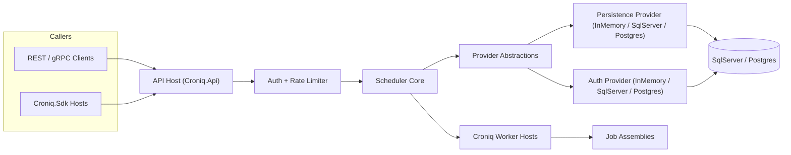

# Croniq Architecture

This document captures the current architecture of Croniq and replaces the earlier concept drafts. It records the validated design choices, service layout, and quality targets that already shape the codebase.

## Product Goals & SLOs

- Provide a modular .NET 10 scheduling platform with a light in-memory execution path, extensible providers, and durable persistence when required.
- Match the feature coverage of established schedulers while lowering boot time and simplifying auth/policy setup.
- Default SLOs:
  - Trigger lookup + schedule evaluation: < 100 ms p50 / < 250 ms p95 for up to 10k active triggers per node.
  - End-to-end job start (trigger to `ExecuteAsync`): < 500 ms p95 (in-memory), < 750 ms p95 (SqlServer/Postgres persistence).
  - Availability: 99.9% monthly for Scheduler/API; API error rate < 0.1% per day.

## Layered Architecture

| Layer                                                                          | Responsibilities                                                                             |
| ------------------------------------------------------------------------------ | -------------------------------------------------------------------------------------------- |
| Scheduler Core (`Croniq.Core`)                                                 | Trigger parsing, schedule evaluation, policies, execution pipeline, `IJob` contracts.        |
| Provider Layer (`Croniq.Persistence.*`, `Croniq.Auth.*`, `Croniq.Providers.*`) | Abstractions and default implementations for persistence, auth, logging, telemetry, secrets. |
| Service Layer (`Croniq.Api`, RPC)                                              | Minimal API endpoints, rate limiting, auth middleware, gRPC/JSON-RPC endpoints.              |
| Jobs Layer (`Croniq.Sdk`, sample job projects)                                 | Authoring model for jobs, DI helpers, samples.                                               |
| Infrastructure (`infra/docker`, `tools/Croniq.DbMigrator`)                     | Docker Compose dev stack, EF Core migrations, helper scripts, future UI.                     |

Hosting extensions (`AddCroniqApiServices`, `AddCroniqApiRateLimiter`, `UseCroniqApi`) wire the pieces together. Auth and persistence can run in `InMemory`, `SqlServer`, or `Postgres` modes via configuration (`Croniq:*`).

## System Diagram



## Repository & Documentation Layout

```text
src/
  Croniq.Core/
  Croniq.JobStore.InMemory/
  Croniq.Persistence.Abstractions/
  Croniq.Persistence.SqlServer/
  Croniq.Persistence.Postgres/
  Croniq.Auth.Abstractions/
  Croniq.Auth.Core/
  Croniq.Auth.SqlServer/
  Croniq.Auth.Postgres/
  Croniq.Data.SqlServer/
  Croniq.Data.Postgres/
  Croniq.Api/
  Croniq.Rpc.Client/
  Croniq.Sdk/
  ...
docs/
  introduction/
  guides/
  ops/
  deep-dive/
```

- `Croniq.Data.SqlServer` and `Croniq.Data.Postgres` centralise EF Core entities, DbContext, and migrations for both persistence and auth.
- `docs` is split into consumer-focused introductions/guides and the deep-dive stream (this document, security, observability, etc.).
- Architecture diagrams now live inline as Mermaid blocks inside this document so they render everywhere without external tooling.

## Persistence & Auth

- SqlServer and Postgres are the canonical durable stores. Scheduler tables live in schema `croniq`, auth tables live in schema `auth`, and every entity records `TenantId`, `EnvironmentTag`, and row metadata.
- `Croniq.Persistence.SqlServer` and `Croniq.Persistence.Postgres` implement `IJobPersistenceProvider`, handling jobs, triggers, leases, and dead letters. The CLI `tools/Croniq.DbMigrator` applies migrations for both providers.
- Auth shares the same DbContext. `Croniq.Auth.SqlServer` and `Croniq.Auth.Postgres` store API clients/keys (hashed secrets with per-key salt); `Croniq.Auth.Core` offers the in-memory fallback for samples/tests.
- Config:
  - `Croniq:Auth:Mode = InMemory|SqlServer|Postgres`; overrides under `Croniq:Auth:SqlServer:*` or `Croniq:Auth:Postgres:*`.
  - `Croniq:Persistence:Mode = InMemory|SqlServer|Postgres`; overrides under `Croniq:Persistence:SqlServer:*` or `Croniq:Persistence:Postgres:*`.
  - Shared connection string at `Croniq:SqlServer:ConnectionString` or `Croniq:Postgres:ConnectionString` unless overridden.
- API key flow (header `X-Croniq-Key`) is the default. Bearer-token flow feeds the same `ICallerContext` abstraction. Rate limiting partitions on `TenantId:CallerId`.

## Scheduler & Execution Semantics

- Trigger types: cron expressions (6 fields + optional year) plus `@once` for one-off schedules; webhook ingress and manual triggers dispatch immediate executions.
- Every job key follows `namespace:name[:variant]`, ensuring a stable identifier while tenant/environment are derived from the hosting scope.
- `IJobExecutionContext` exposes metadata, logger, and telemetry hooks. Jobs log and rethrow exceptions so policies can respond.
- Misfires are retried while `MaxMisfireDelay` (default 5 minutes) is respected. Beyond that the execution is marked as dead letter.
- Delivery semantics: at-least-once by default. Callers can attach idempotency metadata for their own handlers if needed.

### Schedule Calendars (Planned)

- Calendars are separate tenant-scoped entities that include or exclude candidate fire times for schedules.
- Triggers keep their cron/once semantics; an optional `CalendarId` filters occurrences after the cron evaluation.
- The concept mirrors Quartz.NET's calendar model and is documented in `docs/deep-dive/designs/schedule-calendars.md`.

### Lease Renewal & Long-Running Jobs

- Each trigger execution is protected by a lease (`Croniq:Persistence:SqlServer:LeaseDurationSeconds`, `Croniq:Persistence:Postgres:LeaseDurationSeconds`, or `Croniq:JobStore:InMemory:LeaseDurationSeconds`, default 60s).
- While a job runs, the worker renews the lease ahead of expiry (`Croniq:WorkerHost:LeaseRenewalLeadTime`, default 10s). Setting this to `00:00:00` disables renewals.
- If renewal fails, the worker cancels the execution and skips releasing the lease to avoid clobbering a new owner; once the lease expires the trigger can be reacquired.
- If renewals are disabled or a lease is lost, another worker may pick up the same trigger while the original handler is still running, so long-running jobs must remain idempotent.
- Keep execution timeouts aligned: `Croniq:Policies:Execution:Timeout:Timeout` defaults to 5 minutes and should remain higher than the lease duration. For long-running jobs, increase/disable the timeout and ensure `LeaseRenewalLeadTime` is comfortably smaller than the lease (e.g., 10s lead on a 60s lease).

## Worker Host Presence

- A worker host is the .NET scheduler/executor process (Croniq.WorkerHost). It uses `Croniq:Core:InstanceId` as the stable identity.
- Presence is tracked via heartbeats (`POST /tenants/{tenantId}/workers/heartbeat`) and listed via `GET /tenants/{tenantId}/workers`. The TTL is controlled by `WorkerStoreOptions.OnlineTtl`.
- Worker presence endpoints require `workers:heartbeat` (post) and `workers:read` (list) scopes.
- Worker hosts emit heartbeats on `Croniq:WorkerHost:HeartbeatInterval` (set to `00:00:00` to disable). The heartbeat interval should remain comfortably below the online TTL.

## Runner Identity & Availability

- A runner represents a **worker process instance** that claims work via the `/work/*` endpoints. One runner can execute many jobs over time.
- `runnerId` is a stable identifier (for example `hostname + process`) and is used as the lease owner. Renew/ack requests must use the same `runnerId` that claimed the lease.
- Authentication stays on the regular Croniq auth paths (API keys or bearer tokens) with least-privilege work scopes (`work:poll`, `work:renew`, `work:ack`, `work:events`). `runnerId` itself is **not** a secret, but it must match the authenticated caller identity.
- Runner availability is tracked via heartbeats (`POST /tenants/{tenantId}/runners/heartbeat`) and listed via `GET /tenants/{tenantId}/runners`. The TTL is controlled by `RunnerStoreOptions.OnlineTtl`. Availability is informational and does not affect lease correctness.

## Polyglot Worker Protocol

- The current HTTP work surface (`/work/poll`, `/work/renew`, `/work/ack`) exposes the lease lifecycle so non-.NET workers can claim and execute jobs.
- The gRPC worker handshake (`Worker.Connect`) is implemented as a skeleton for streaming integrations.
- The longer-term gRPC streaming contract and planned work-item schema are captured in `docs/deep-dive/designs/polyglot-worker-protocol.md`.
- Protocol design avoids global heartbeats; ownership and liveness are derived from lease deadlines and acknowledgements.

## Job Store & Provider Model

- In-memory JobStore (`Croniq.JobStore.InMemory`) stays the default for dev/test while all operations flow through `IJobPersistenceProvider` contracts.
- SqlServer/Postgres providers add durability, leases, recovery, and future clustering. Locking uses relational concurrency tokens and optional lease tables.
- Providers also exist for auth, logging (ILogger plus optional Serilog), telemetry (OpenTelemetry), secrets, and future extensions (queues, notifications).
- All persistence access goes through EF Core. Schema changes use migrations (`dotnet ef migrations add ...` in `Croniq.Data.SqlServer` and `Croniq.Data.Postgres`). CI runs `Croniq.DbMigrator` to apply migrations and detect drift.

## API & RPC Surface

- Minimal API endpoints: `POST /jobs/trigger`, `POST /tenants/{tenantId}/schedules`, `GET/DELETE /tenants/{tenantId}/schedules/{id}`, `GET /health` (anonymous).
- gRPC service (`SchedulerService`) offers strongly typed access (`TriggerJob`, `RegisterSchedule`, `GetSchedules`). JSON-RPC may appear later but is not core.
- Hosting packages expose opinionated extensions so consumers can bootstrap Croniq quickly. Auth, persistence mode, and rate limits are all configuration-driven.
- Rate limiting uses ASP.NET Core RateLimiter with per-tenant partitions; gRPC interceptors reuse the same policy.

### Tenant-scoped routes as the default

- All management endpoints (schedules, executions, admin CRUD) live under `/tenants/{tenantId}/{resource}`. With no external consumers yet, we accept the breaking changes now to avoid duplicate paths later.
- `POST /schedules` and `GET /executions/{executionId}/logs` moved to `/tenants/{tenantId}/schedules` and `/tenants/{tenantId}/executions/{executionId}/logs`. Legacy paths are removed.
- Target REST surface (excluding public trigger/webhook ingress):
  - `/tenants/{tenantId}/schedules`
  - `/tenants/{tenantId}/executions`
  - `/tenants/{tenantId}/api-clients`, `/api-keys`, `/tokens`
  - `/jobs/trigger` (remains global)
  - Webhook admin endpoints under `/tenants/{tenantId}/webhooks*` plus ingress at `/tenants/{tenantId}/environments/{environmentTag}/webhooks/{hookKey}`
  - Execution overview: `GET /tenants/{tenantId}/executions` returns filterable lists, `GET /tenants/{tenantId}/executions/{executionId}` returns details. Both require the `executions:read` scope and use `IExecutionHistoryReader` [src/Croniq.Api/ApiHostingExtensions.cs#L200-L330](../../src/Croniq.Api/ApiHostingExtensions.cs#L200-L330).
  - API client management and token issuance live under `/tenants/{tenantId}/api-clients*` and `/tenants/{tenantId}/tokens` [src/Croniq.Api/ApiHostingExtensions.cs#L1040-L1294](../../src/Croniq.Api/ApiHostingExtensions.cs#L1040-L1294).
- Implementation steps:
  1. Move API code to the new routes and remove legacy routes in the same release (breaking change is acceptable before `v1.0.0`).
  2. Update UI/SDKs and scripting samples to use the consistent base path.
  3. Update documentation, OpenAPI descriptions, and tests to the new routes.

## Webhook Trigger Surface

- **Goal**: Allow external systems or internal apps to push HTTP events into Croniq without custom glue code. Each tenant mints webhook receivers that immediately trigger jobs, making Webhooks a first-class trigger source alongside cron, interval, and event streams.
- **Host Composition**: `Croniq.Webhooks` is a Minimal API host that reuses `Croniq.Hosting` for DI (auth, persistence, policies). Only ingress-specific pieces live here: signature validation, rate limiting, payload inspection, and dispatch into the execution pipeline. `AddCroniqWebhookServices` wires everything up for both the standalone host and co-hosted samples.
- **Deployment Guidance**: Run `Croniq.Webhooks` as an independent deployment whenever you expect bursty ingress traffic or need separate autoscaling from `Croniq.Api`. Samples (and very small tenants) can co-host both surfaces in a single process by calling `UseCroniqWebhooks(mapHealthEndpoints: false)` inside the API host, but production topologies typically expose two pods / services so management calls stay isolated from webhook storms.
- **DMZ Ingress-Only**: Remote webhook persistence plus an ingress event stream and relay worker allow DMZ ingress with no outbound connections into the internal network. DMZ hosts run `Croniq.Api` in `WebhookAdminOnly` mode alongside `Croniq.Webhooks` with `Ingress.DispatchMode=StoreOnly`, while internal hosts use `Croniq:Webhooks:Mode=Remote` and the relay worker (requires `webhooks:ingress` scope). See `docs/deep-dive/designs/dmz-ingress-remote-webhooks.md` for topology and config.
- **Endpoints & Protocols**: Ingress routes such as `POST /tenants/{tenantId}/environments/{environmentTag}/webhooks/{hookKey}` accept JSON payloads today, with a standardized event envelope planned. Each hook maps to a registered `JobKey`. Payload metadata is projected into `IJobExecutionContext` with `webhook:*` and `payload:*` prefixes so downstream jobs can branch without re-parsing JSON.
- **Configuration Source**: Hooks are defined under `Croniq:Webhooks` (in-memory for dev) or persisted via `Croniq.Persistence.SqlServer` or `Croniq.Persistence.Postgres` once the admin API lands. The shape includes `HookKey`, `JobKey`, `Secret`, per-hook `RequestsPerMinute`, and arbitrary metadata. The host falls back to global defaults when per-hook values are omitted.
- **Processing Stages**: Request enters `Croniq.Webhooks` -> hook lookup for tenant/environment scope -> HMAC signature validation (`X-Croniq-Signature`) -> named ASP.NET Core rate limiter partitioned per hook -> payload normalization/metadata enrichment -> dispatch. In standard mode the dispatcher executes via `IJobExecutionPipeline`; in DMZ StoreOnly mode it persists a `WebhookIngressEvent` for the internal relay worker. Failures bubble into policy-based retries, logging, and a `WebhookIngressEvent`/dead-letter record for diagnostics.
- **Security & Observability**: TLS is mandatory; secrets are returned only on create/rotate and stored encrypted at rest via Data Protection (share the key ring across hosts), so treat the database as sensitive; validation runs in constant time to avoid timing attacks. OpenTelemetry spans (`Croniq.Webhooks.Ingress`) capture hook/job tags, and the host exports the same metrics/logging decorators as `Croniq.Api`, making it easy to monitor ingress pressure separately from management traffic.
- **Docs Impact**: `docs/guides/webhooks.md` demonstrates configuration + curl usage, the quickstart teaches how to co-host webhooks, and this section outlines deployment trade-offs so operators understand when to promote the ingress to a dedicated service.

### Webhook Persistence & Admin Lifecycle (Preview)

- **Schema**: `Croniq.Persistence.SqlServer` and `Croniq.Persistence.Postgres` persist hooks in `croniq.WebhookEndpoints`, record cache-invalidation events inside `croniq.WebhookEndpointEvents`, capture failed payloads in `croniq.WebhookDeadLetters`, and store rotation trails inside `croniq.WebhookSecretHistory`. Each record keeps tenant/environment scope, `HookKey`, `JobKey`, encrypted secret material (plus hash), signature version, rate limit, metadata JSON, and audit timestamps.
- **Migrations**: EF Core migrations ship through `Croniq.DbMigrator`, so Compose/test stacks no longer rely on `EnsureCreated`. Dev/test environments can still fall back to `Croniq:Webhooks` configuration when a relational provider is not available.
- **Contract tests**: `SqlServerWebhookPersistenceProviderTests` (in `tests/Croniq.Persistence.SqlServer.Tests`) and `PostgresWebhookPersistenceProviderTests` (in `tests/Croniq.Persistence.Postgres.Tests`) exercise CRUD + scope enforcement so providers stay consistent with the admin API.
- **Admin API**: `Croniq.Api` now exposes tenant-scoped CRUD endpoints (`POST/GET/DELETE /tenants/{tenantId}/webhooks?environment=<tag>`). Each request validates the job key scope, enforces per-hook rate limits, and returns the freshest secret (only when you explicitly send a new one) so automation pipelines can bootstrap callers.
- **Capabilities API**: `GET /tenants/{tenantId}/webhooks/capabilities?environment=<tag>` returns the default rate limit and whether unsigned hooks are permitted, sourced from local config or remote persistence so UIs can avoid configuration drift.
- **Host Bootstrapping**: `Croniq.Webhooks` prefers the persistence provider, caching lookups per hook and falling back to configuration entries only when no stored definition exists. A hosted `WebhookEndpointCacheInvalidationService` drains the SqlServer/Postgres changefeed and evicts cache entries immediately after CRUD operations; remaining fallback TTLs keep config-defined hooks responsive.
- **Changefeed & Cache Invalidation**: Every upsert/delete emits a row into `croniq.WebhookEndpointEvents`. `SqlServerWebhookEndpointChangefeed` and `PostgresWebhookEndpointChangefeed` expose those rows as ordered streams, and the hosted invalidation service polls in lightweight batches (configurable interval + batch size under `Croniq:Webhooks:Cache`). This keeps rate limiter metadata and secrets hot without relying on 30-60s cache expirations.
- **Secret Rotation**: The admin API exposes `POST /tenants/{tenantId}/webhooks/{hookKey}/rotate-secret?environment=<tag>` which appends to `WebhookSecretHistory`, returns a fresh secret once, and keeps the previous secret alive for a configurable grace window (default 24h). Rotations can optionally be scheduled up to seven days in advance via `activateInSeconds`, and the helper `scripts/webhook-rotate-secret.ps1` wraps the call for local/CI operators. `Croniq.Webhooks` automatically validates signatures against all active secrets so upstream callers can cut over without downtime.
- **Unsigned Hooks Guardrails**: Signature validation stays enabled by default. Operators must set `Croniq:Webhooks:Security:AllowUnsignedHooks=true` (or enable it via remote capabilities) and pass `allowUnsigned=true` in the webhook payload when creating an unsigned hook; ingress warns the first time an unsigned payload is accepted so there is an audit breadcrumb.
- **Operational Insights**: Use OpenTelemetry spans (`Croniq.Webhooks.Ingress`), the planned API audit log stream, and the Webhook dead-letter table + replay endpoint to rehydrate failed webhook deliveries without digging through raw logs.
- **Open Tasks**:
  1. Extend secret rotation with dual-secret windows and `WebhookSecretHistory` persistence so rotations become zero-downtime and auditable.
  2. Harden the CRUD endpoints with authentication/authorization scopes plus integration tests (currently only happy-path smoke coverage exists).
  3. Provide CLI/SDK helpers (or scripted samples) for provisioning hooks, including secret export masking rules.

## Job Authoring Model

- `Croniq.Sdk` defines `[CroniqJob]` attribute, `IJob`, DI helpers (`AddCroniqJob<T>` / `AddCroniqJob("namespace", "name", handler)`).
- Jobs live in dedicated class libraries per domain. Packaging guidelines recommend NuGet distribution to enforce versioning.
- Inline handlers use delegates; complex workflows should implement `IJob` directly.

## Policies & Error Handling

- Policy engine builds on Polly (retry, timeout, circuit). Policies attach via configuration; a fluent per-job builder is on the backlog.
- Dead-letter routing persists payload and reason, default retention 30 days (configurable). Recoveries feed into admin tooling via SqlServer/Postgres tables.
- Concurrency controls limit overlapping runs per job; idempotency remains a caller concern today.

## Observability & Deployment

- Logging: uses `ILoggerFactory` by default; `AddCroniqObservability` can enable Serilog with optional OpenTelemetry log export. Structured fields include tenant/environment/job context.
- Metrics/Traces: OpenTelemetry SDK emitting OTLP by default. Dev stack ships with collector + Grafana + Tempo + Prometheus + Loki (optional).
- Docker strategy: multi-stage .NET 10 images, Compose stack for API, worker, SQL Server (default), observability, optional RPC sample. Postgres is supported when you supply an external instance.
- GitHub Actions build/test/publish NuGet packages and OCI images, uploading docs previews as artifacts.

## Reliability, Recovery & Tenant Isolation

- Recovery flow: on startup, load persisted triggers, clean stale locks, resume pending executions before declaring the instance healthy.
- Retention defaults: execution log retention is 7 days (hourly sweep) when `ExecutionLogRetentionService` is hosted. Relational retention jobs are disabled by default (`Croniq:Retention:Enabled=false`); if enabled, refresh tokens default to 14 days after expiry, webhook endpoint events 30 days, and webhook secret history 7 days after expiry. Job/webhook dead letter pruning is disabled unless configured.
- Tenant isolation is enforced everywhere: persistence schemas, caller context, telemetry dimensions, rate limiting, and API scopes.
- Quotas are enforced per JobKey/scope using `MaxTriggersPerMinute` (default 60) and `MaxParallelExecutionsPerJob` (default 5) from `Croniq:Policies:*`. API rate limits are separate (`Croniq:Api:RequestsPerMinute` + `Croniq:Api:TenantRateLimits`).

## Release, Testing & Compliance

- Versioning: SemVer for libraries/SDKs, `/v1` routes for HTTP APIs. Breaking changes require new majors plus deprecation windows.
- Testing strategy: unit tests (xUnit) + contract tests (provider fixtures/Testcontainers) + Compose-based smoke/e2e suites (nightly and pre-release). Coverage gates: Core line >=73%, overall line >=75%, branch coverage >=55% (overall + Core).
- Release pipeline runs migrations (`Croniq.DbMigrator`), executes smoke tests, produces SBOMs (Syft) and signs artifacts (Cosign/SignPath). Dependency updates are scanned via Trivy/Snyk and tracked by Renovate.

## Roadmap Snapshots

- **UI**: Deferred until API/providers stabilize. Requirements include schedule overview, trigger management, execution history.
- **Kubernetes**: Future Helm chart (`charts/croniq`) with API/worker deployments, SQL Server/Postgres StatefulSet, migration jobs, ExternalSecrets integration, and pre-wired observability.
- **Clustering**: Arrives with GA relational providers once lease/heartbeat tables are production-ready. Cluster health endpoints (`/cluster/nodes`) will expose status.

---

Future architectural decisions should update this document (and referenced deep-dive sheets) directly.
