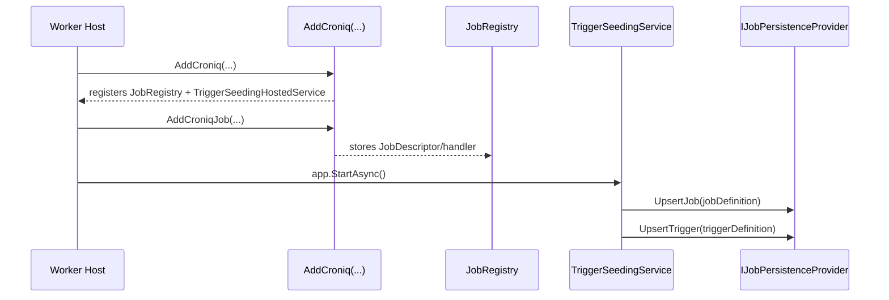

# Croniq Job Registration Flow

This deep dive explains how Croniq discovers jobs, composes job keys, and persists schedules. It complements the Quickstart by describing what happens behind `AddCroniqJob(...)` and `AddCroniq()`.

::: info Status
Implemented. Last verified: 2026-01-18.
:::

## Discovery Options

Croniq supports multiple registration styles:

1. **Inline handlers** - call `builder.Services.AddCroniqJob("namespace", "name", handler)` and provide a delegate. This uses an internal delegating `IJob` that dispatches to the handler.
2. **Attributed classes** - implement `IJob`, decorate with `[CroniqJob("namespace", "name", variant: "optional")]`, and register via `AddCroniqJob<TJob>()`.
3. **Assembly scanning** - call `AddCroniqJobsFromAssembly(assembly)` to register all `[CroniqJob]` types from the target assembly.
4. **Config-driven assembly loading** - call `AddCroniqJobsFromConfiguration(builder.Configuration)` and set `Croniq:Jobs:Assemblies` to scan job assemblies at startup.

Both paths produce a `JobDescriptor` with a deterministic job key.

## JobKey Composition

- Format: `namespace:name[:variant]`
- Tenant/environment are part of the execution scope (`PartitionScope`), not embedded in the job key. Defaults come from `Croniq:Core:*` unless overridden per host or caller.
- Namespace + name must be deterministic and unique per tenant/environment to avoid collisions.

## Trigger Persistence & Startup Flow

Jobs are registered in DI, but schedules are persisted through seeding (worker hosts) or API/gRPC (platform hosts).



If schedules are created via the API/gRPC, the API host upserts jobs/triggers directly. Worker hosts only need the job registrations to execute them.

## Seeding Sources

Seeding reads from two sources:

- **Configuration**: `Croniq:Triggers` (list or map).
- **Fluent**: `AddCroniqJob(...).AddTrigger(...)`.

The seeding mode is controlled by `Croniq:Seeding:Mode`:

- `Off` disables seeding.
- `CreateIfMissing` creates only new triggers (default).
- `ForceUpdate` updates existing triggers only when `managedBy` matches.

`Croniq:Startup:Mode=Validate` runs the validation pipeline without starting worker loops, which is useful for CI and preflight checks.

Invalid cron expressions, missing job registrations, or scope mismatches fail fast at startup.

## Job Registry Sync

Job registry sync is an opt-in hosted service that upserts job definitions from `IJobRegistry` into the persistence store. It is intended for minimal deployments where you want job metadata visible without manually creating jobs or schedules.

Key behavior:

- **No triggers** are created and **no deletes** are issued.
- `Mode = CreateIfMissing` only creates missing jobs.
- `Mode = ForceUpdate` updates existing jobs only when their `metadata.managedBy` matches the configured `ManagedBy` value.

Example configuration:

```json
{
  "Croniq": {
    "JobRegistrySync": {
      "Mode": "CreateIfMissing",
      "ManagedBy": "Croniq.WorkerHost"
    }
  }
}
```

## Execution Context

`IJobExecutionContext` provides:

- `ExecutionId` for correlation.
- `JobKey` and `Metadata` (metadata comes from schedules or manual triggers).
- `Logger` and `ActivitySource` for observability.

## Policies & Overrides

Policies are configured via `Croniq:Policies:*`. Use `Croniq:Policies:Overrides` for per-job overrides. There is no fluent per-job policy builder yet.

## Failure Modes

| Scenario                      | Behavior                          | Recommendation                                        |
| ----------------------------- | --------------------------------- | ----------------------------------------------------- |
| Duplicate job keys            | Startup throws before workers run | Keep namespace/name unique per tenant/environment     |
| Invalid cron expression       | Seeding throws and stops startup  | Validate cron strings before deploy                   |
| ForceUpdate without managedBy | Seeding throws                    | Set `ManagedBy` on seeded triggers                    |
| Persistence unavailable       | Seeding fails and startup stops   | Ensure the store is reachable before starting workers |

## Backlog

- Fluent per-job policy builder.
