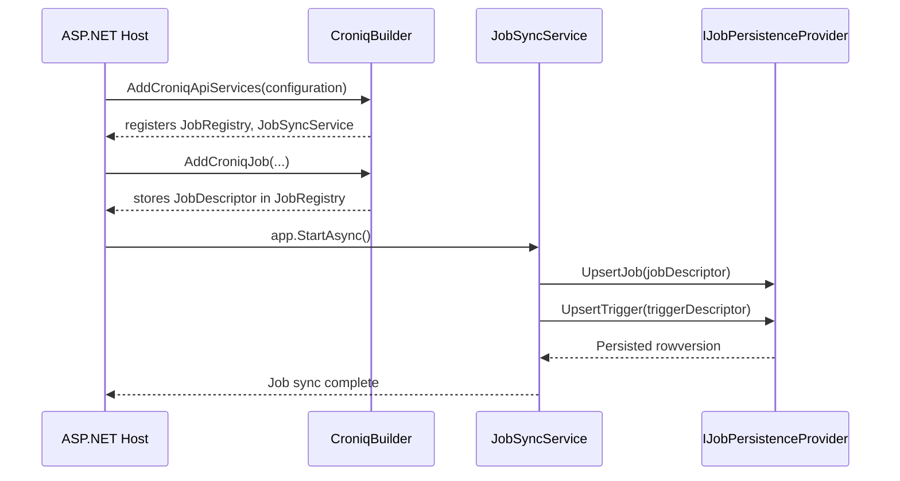

# Croniq Job Registration Flow

This deep dive explains how Croniq discovers jobs, composes metadata, syncs definitions with persistence, and exposes them to the scheduler. It complements the consumer Quickstart by revealing what happens behind `AddCroniqJob(...)` and `AddCroniq()`.

## Discovery Options

Croniq supports two primary registration styles:

1. **Fluent jobs** – call `builder.Services.AddCroniqJob(jobKey, job => ...)` and configure handlers/policies inline.
2. **Attributed classes** – implement `IJob`, decorate with `[CroniqJob("namespace", "name", variant: "optional")]`, and register via `AddCroniqJob<TJob>()`.

Internally, both paths produce a `JobDescriptor` (job key, handlers, metadata, policies) stored in DI for later syncing.

### JobKey composition

- Format: `TenantId:EnvironmentTag:Namespace:Name[:Variant]`.
- Tenant/environment default to `Croniq:Core:*` options unless overridden per host.
- Namespace + name must be deterministic and unique per tenant/environment to avoid collisions in the persistence store.

## Startup Pipeline

- `JobRegistry` keeps descriptors until the host builds.
- `JobSyncService` runs as a hosted service. On startup it iterates descriptors, compares rowversions, and upserts jobs/triggers into the configured `IJobPersistenceProvider`.
- When persistence runs in-memory, the sync simply seeds the in-memory store; with SqlServer it uses EF Core transactions.

## Handler Execution Context

- Each handler receives `IJobExecutionContext` with job key, metadata, logger, and telemetry hooks.
- Extension methods provide `InitProgress`, `ReportProgress`, and `CustomState` to send status into telemetry/logs.
- Policies (retry, timeout, concurrency, dead letters) wrap the handler pipeline in the order they were registered.

## Metadata & Policies

- Arbitrary metadata can be attached via `job.WithMetadata(key, value)`; values are persisted and surface in API payloads/logs.
- Concurrency, retry, timeout, and dead-letter policies map directly to the Polly-based engine described in `deep-dive/policies.md`.
- Idempotency configuration is optional; when set, Croniq reads the key from execution metadata to deduplicate results.

## Sync Failure Modes

| Scenario | Behavior | Recommendation |
| --- | --- | --- |
| Duplicate job keys | Sync aborts with a descriptive exception before the host starts | Ensure namespace/name pairs are unique per tenant/environment |
| Persistence unavailable | Hosted service retries with exponential backoff; host fails readiness checks until sync succeeds | Use health probes and `scripts/devstack-up.cmd` to ensure DB is online |
| Schema drift | `Croniq.DbMigrator --verify` catches missing migrations; sync fails with `DbUpdateException` | Always run migrations before deploying new code |

## Testing & Tooling

- Unit tests: `Croniq.Core.Tests` exercises job descriptors and policy chains.
- Contract tests: `Croniq.Persistence.SqlServer.Tests` validate `UpsertJob/Trigger` semantics against Testcontainers.
- Sample hosts under `samples/` demonstrate both fluent and class-based jobs; reference them when authoring docs or verifying new APIs.

## Backlog

- Support hot-reload of job descriptors without redeploying (watcher service).
- Document the CLI/API workflow for dynamic job creation (outside of startup).
- Surface job sync status in `/health` endpoints and operator dashboards.
