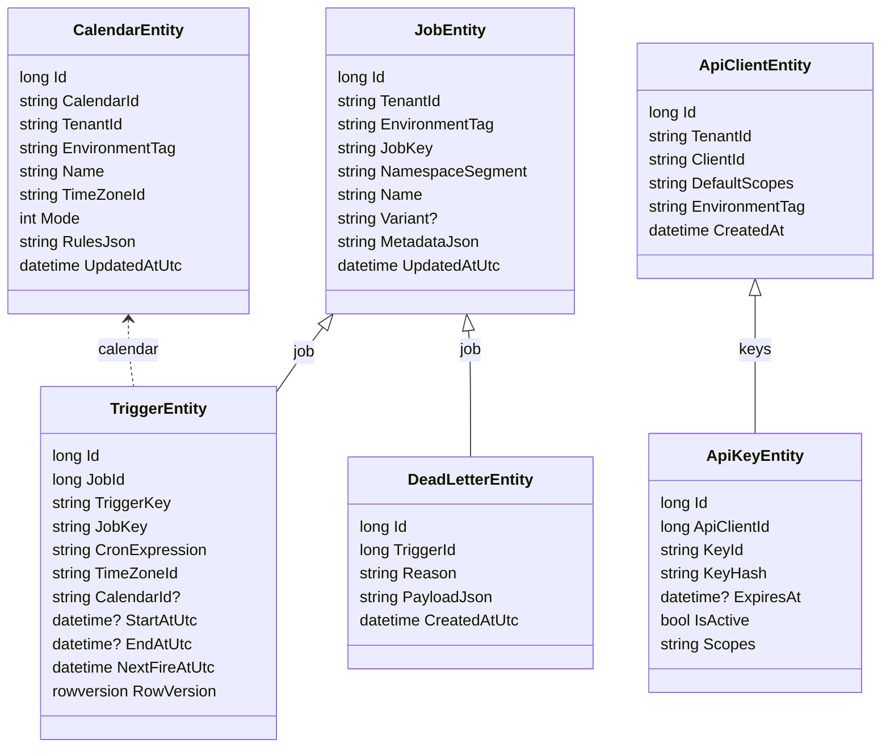

# Croniq Relational Persistence (SqlServer + Postgres)

This document describes the relational persistence layer for Croniq: schema layout, DbContext usage, migration workflow, and operational guidance for SqlServer and Postgres. It captures the decisions referenced in `architecture.md` and fulfills the docstreams backlog item "Document persistence deep dive".

## Scope & Goals

- A single relational database uses the `croniq` schema for scheduler persistence and the `auth` schema for auth data by default.
- Every entity includes `TenantId`, `EnvironmentTag`, and concurrency metadata to guarantee tenant isolation.
- EF Core is the only abstraction; migrations are versioned in `src/Croniq.Data.SqlServer/Migrations` and `src/Croniq.Data.Postgres/Migrations` and applied via `tools/Croniq.DbMigrator`.
- Croniq hosts can switch between in-memory and relational persistence via configuration (`Croniq:Persistence:Mode`).

## Schema Overview

Below is a simplified entity diagram covering the scheduler (`croniq`) and auth (`auth`) tables (shared DbContext).



Additional tables (calendars, leases, worker instances) follow the same tenant/environment pattern; audit logging is planned but not yet implemented. Scheduler tables live under `croniq` while auth tables live under `auth`. See `SqlServerDbContext` and `PostgresDbContext` for exact property lists. SqlServer uses `rowversion` for concurrency; Postgres uses the `xmin` system column.

## Code Layout

```text
src/Croniq.Data.SqlServer/
  SqlServerDbContext.cs
  SqlServerOptions.cs
  Entities/
    JobEntity.cs
    CalendarEntity.cs
    TriggerEntity.cs
    DeadLetterEntity.cs
    ApiClientEntity.cs
    ApiKeyEntity.cs
    ...
src/Croniq.Data.Postgres/
  PostgresDbContext.cs
  PostgresOptions.cs
  Entities/
    JobEntity.cs
    TriggerEntity.cs
    DeadLetterEntity.cs
    ApiClientEntity.cs
    ApiKeyEntity.cs
    ...
src/Croniq.Persistence.SqlServer/
  SqlServerJobPersistenceProvider.cs
  ServiceCollectionExtensions.cs
src/Croniq.Persistence.Postgres/
  PostgresJobPersistenceProvider.cs
  ServiceCollectionExtensions.cs
src/Croniq.Auth.SqlServer/
  SqlServerApiKeyStore.cs
  ServiceCollectionExtensions.cs
src/Croniq.Auth.Postgres/
  PostgresApiKeyStore.cs
  ServiceCollectionExtensions.cs
tools/Croniq.DbMigrator/
  Program.cs
```

- `Croniq.Data.SqlServer` exposes `AddCroniqSqlServerDbContext(IServiceCollection, SqlServerOptions)` for host registration.
- `Croniq.Data.Postgres` exposes `AddCroniqPostgresDbContext(IServiceCollection, PostgresOptions)` for host registration.
- `Croniq.Persistence.SqlServer` and `Croniq.Persistence.Postgres` implement `IJobPersistenceProvider` and add health checks.
- `Croniq.Auth.SqlServer` and `Croniq.Auth.Postgres` depend on the shared DbContext, providing `IApiKeyStore` and password auth services.

## Configuration Matrix

| Setting                                              | Purpose                                                     | Notes                                                                           |
| ---------------------------------------------------- | ----------------------------------------------------------- | ------------------------------------------------------------------------------- |
| `Croniq:SqlServer:ConnectionString`                  | Default SqlServer connection string for auth + persistence  | Example: `Server=localhost,1433;Database=Croniq;User Id=sa;Password=Secret123!` |
| `Croniq:SqlServer:CommandTimeoutSeconds`             | EF Core command timeout (seconds) for SqlServer             | Shared default for auth + persistence                                           |
| `Croniq:Postgres:ConnectionString`                   | Default Postgres connection string for auth + persistence   | Example: `Host=localhost;Database=Croniq;Username=postgres;Password=Secret123!` |
| `Croniq:Postgres:CommandTimeoutSeconds`              | EF Core command timeout (seconds) for Postgres              | Shared default for auth + persistence                                           |
| `Croniq:Postgres:SearchPath`                         | Optional Postgres search path                               | Example: `croniq,auth,public`                                                   |
| `Croniq:Persistence:Mode`                            | Selects `InMemory`, `SqlServer`, or `Postgres`              | Controls which provider `AddCroniqApiServices` wires up                         |
| `Croniq:Persistence:SqlServer:ConnectionString`      | Optional override for persistence-only SqlServer connection | Falls back to `Croniq:SqlServer:ConnectionString`                               |
| `Croniq:Persistence:SqlServer:CommandTimeoutSeconds` | Optional override for persistence-only SqlServer timeout    | Falls back to `Croniq:SqlServer:CommandTimeoutSeconds`                          |
| `Croniq:Persistence:Postgres:ConnectionString`       | Optional override for persistence-only Postgres connection  | Falls back to `Croniq:Postgres:ConnectionString`                                |
| `Croniq:Persistence:Postgres:CommandTimeoutSeconds`  | Optional override for persistence-only Postgres timeout     | Falls back to `Croniq:Postgres:CommandTimeoutSeconds`                           |
| `Croniq:Auth:Mode`                                   | Selects `InMemory`, `SqlServer`, or `Postgres`              | Auth shares the DbContext when relational                                       |
| `Croniq:Auth:SqlServer:ConnectionString`             | Optional override for auth-only SqlServer connection        | Use when auth DB is separate                                                    |
| `Croniq:Auth:Postgres:ConnectionString`              | Optional override for auth-only Postgres connection         | Use when auth DB is separate                                                    |

## Migration Workflow

1. **Create/Update entities** in `src/Croniq.Data.SqlServer/Entities` or `src/Croniq.Data.Postgres/Entities`.
2. **Add a migration** from the repository root (run `dotnet tool restore` once to install the local `dotnet-ef` tool):

   ```cmd
   dotnet ef migrations add <Name> --project src/Croniq.Data.SqlServer --startup-project tools/Croniq.DbMigrator --output-dir Migrations
   ```

   ```cmd
   dotnet ef migrations add <Name> --project src/Croniq.Data.Postgres --startup-project tools/Croniq.DbMigrator --output-dir Migrations
   ```

   Make sure the generated migration files are checked in, including the `*.Designer.cs` files and `SqlServerDbContextModelSnapshot.cs`/`PostgresDbContextModelSnapshot.cs`. EF Core uses the designer attributes to discover migrations, and missing designer files will surface as "No EF Core migrations were discovered" in CI.

3. **Apply locally** via the migrator:

   ```cmd
   set CRONIQ_DB_PROVIDER=SqlServer
   set CRONIQ_SQL_CONNECTION=Server=<sql-host>;Database=Croniq;User Id=cronq_admin;Password=<secret>;
   dotnet run --project tools/Croniq.DbMigrator
   ```

   ```cmd
   set CRONIQ_DB_PROVIDER=Postgres
   set CRONIQ_POSTGRES_CONNECTION=Host=<pg-host>;Database=Croniq;Username=croniq_admin;Password=<secret>;
   dotnet run --project tools/Croniq.DbMigrator
   ```

   If you only set one provider connection string, `Croniq.DbMigrator` infers the provider automatically. If both are set, you must provide `CRONIQ_DB_PROVIDER`.

4. **Verify CI**: CI runs `Croniq.DbMigrator` against a test database to detect migration drift.
5. **Docs**: Update this file (and any consumer references) whenever connection options or defaults change.

### Applying `WebhookEndpointIpRules` (2025-12)

The `WebhookEndpointIpRules` migration ships with Croniq `main` (Dec 2025) and must be applied before enabling webhook IP allow lists in production:

1. **Set the connection string** for the migrator container/CLI:

```cmd
set CRONIQ_DB_PROVIDER=SqlServer
set CRONIQ_SQL_CONNECTION=Server=<sql-host>;Database=Croniq;User Id=cronq_admin;Password=<secret>;
```

```cmd
set CRONIQ_DB_PROVIDER=Postgres
set CRONIQ_POSTGRES_CONNECTION=Host=<pg-host>;Database=Croniq;Username=croniq_admin;Password=<secret>;
```

2. **Run the migrator once per environment** (dev/test/prod). The tool is idempotent, so reruns are safe:

```cmd
dotnet run --project tools/Croniq.DbMigrator
```

> Containerized clusters can execute the same step with `docker compose run --rm croniq-db-migrator` as long as the provider connection settings are injected.

3. **Verify the table exists** before exposing the new API endpoints:

```sql
SELECT TOP (5) HookKey, TenantId, EnvironmentTag, Cidr
FROM croniq.WebhookEndpointIpRules
ORDER BY CreatedAtUtc DESC;
```

```sql
SELECT HookKey, TenantId, EnvironmentTag, Cidr
FROM croniq.WebhookEndpointIpRules
ORDER BY CreatedAtUtc DESC
LIMIT 5;
```

4. **Rollback plan**: restore from backup if the migration fails. The schema change is additive (new table + indexes), so no data loss occurs when rolling forward again.

## Local Development & Dev Stack

- The Docker dev stack (`infra/docker/docker-compose.yml`) launches SQL Server 2022 with the Croniq schema. Compose derives `CRONIQ_SQL_CONNECTION` from `CRONIQ_SQL_HOST`, `CRONIQ_SQL_DATABASE`, and `CRONIQ_SQL_PASSWORD` (using `sa` on port 1433) based on `.env`.
- `scripts\devstack-up.cmd` waits for SQL health before running the migrator container (`croniq-db-migrator`).
- Developers can also run `dotnet run --project tools/Croniq.DbMigrator` manually (reads `CRONIQ_SQL_CONNECTION` or `CRONIQ_POSTGRES_CONNECTION` when set).
- Postgres is supported for local/dev environments by pointing `CRONIQ_DB_PROVIDER=Postgres` and `CRONIQ_POSTGRES_CONNECTION` at an external Postgres instance (the default Compose stack does not yet include a Postgres container).
- Test projects rely on Testcontainers to spin up SqlServer and Postgres and call the migrator automatically.

## Clustering & Leases (Future)

Clustering rides on the same relational providers once GA-ready:

- Lease tables (`croniq.TriggerLeases`, `croniq.WorkerInstances`) coordinate trigger ownership.
- Heartbeats and grace periods prevent duplicate executions after failover.
- Cluster health endpoints (`/cluster/nodes`) read directly from these tables.

This document will expand with schema details once clustering ships.

## Operational Guidance

- Use the shared DbContext for both persistence and auth to avoid duplication. If production separates the databases, configure the domain-specific connection strings.
- Enable encryption-at-rest and TLS in production SQL instances; Croniq uses the ADO.NET connection string for SqlServer or the Npgsql connection string for Postgres.
- Monitor `SqlServerJobPersistenceProvider` and `PostgresJobPersistenceProvider` health checks; they expose readiness/liveness for the API and worker hosts.
- Set retention policies via configuration. Retention jobs are implemented and configured via `Croniq:Retention` and `ExecutionLogRetentionOptions`.

## Backlog & Ownership

- Finish the lease/worker instance tables for clustering (tracked in `architecture.md`).
- Keep retention configuration aligned with `CroniqRetentionOptions` and `ExecutionLogRetentionOptions` whenever defaults change.
- Mirror any schema changes in both this doc and the consumer configuration guide so operators know which settings exist.
- Owners: `@CroniqMaintainers` (persistence), `@CroniqDocs` (documentation).
