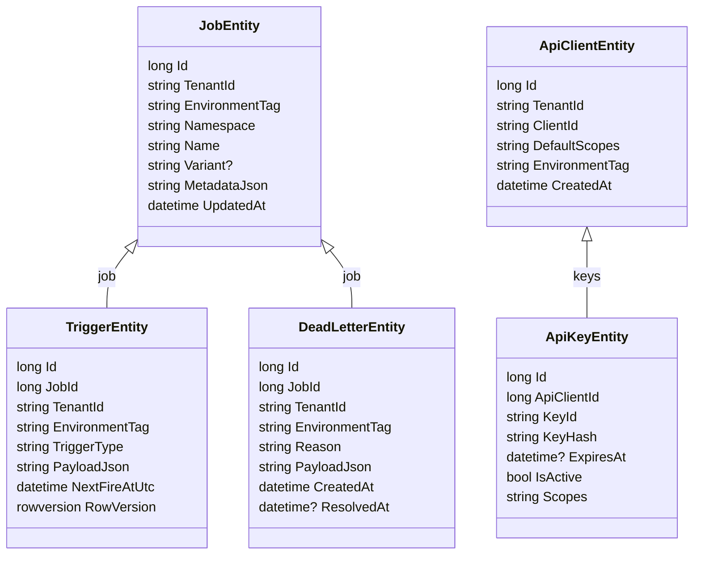

# Croniq SqlServer Persistence

This document describes the current SqlServer persistence layer for Croniq: schema layout, DbContext usage, migration workflow, and operational guidance. It captures the decisions referenced in `architecture.md` and fulfils the docstreams backlog item "Document persistence deep-dive".

## Scope & Goals

- A single SqlServer schema (`croniq`) backs both scheduler persistence and auth data.
- Every entity includes `TenantId`, `EnvironmentTag`, and concurrency metadata to guarantee multi-tenant isolation.
- EF Core is the only abstraction; migrations are versioned in `src/Croniq.Data.SqlServer/Migrations` and applied via `tools/Croniq.DbMigrator`.
- Croniq hosts can switch between in-memory and SqlServer persistence via configuration (`Croniq:Persistence:Mode`).

## Schema Overview

Below is a simplified entity diagram covering the scheduler and auth tables (shared DbContext).



Additional tables (leases, worker instances, audit log) follow the same tenant/environment pattern; see `SqlServerDbContext` for exact property lists.

## Code Layout

```text
src/Croniq.Data.SqlServer/
  SqlServerDbContext.cs
  SqlServerOptions.cs
  Entities/
    JobEntity.cs
    TriggerEntity.cs
    DeadLetterEntity.cs
    ApiClientEntity.cs
    ApiKeyEntity.cs
    ...
src/Croniq.Persistence.SqlServer/
  SqlServerJobPersistenceProvider.cs
  ServiceCollectionExtensions.cs
src/Croniq.Auth.SqlServer/
  SqlServerApiKeyStore.cs
  ServiceCollectionExtensions.cs
tools/Croniq.DbMigrator/
  Program.cs
```

- `Croniq.Data.SqlServer` exposes `AddCroniqSqlServerDbContext(IServiceCollection, SqlServerOptions)` for host registration.
- `Croniq.Persistence.SqlServer` implements `IJobPersistenceProvider` and adds health checks.
- `Croniq.Auth.SqlServer` depends on the same DbContext, providing `IApiKeyStore`.

## Configuration Matrix

| Setting                                              | Purpose                                                | Notes                                                                           |
| ---------------------------------------------------- | ------------------------------------------------------ | ------------------------------------------------------------------------------- |
| `Croniq:SqlServer:ConnectionString`                  | Default connection string shared by auth + persistence | Example: `Server=localhost,1433;Database=Croniq;User Id=sa;Password=Secret123!` |
| `Croniq:Persistence:Mode`                            | `InMemory` or `SqlServer`                              | Controls which provider `AddCroniqApiServices` wires up                         |
| `Croniq:Persistence:SqlServer:ConnectionString`      | Optional override for persistence only                 | Falls back to `Croniq:SqlServer:ConnectionString`                               |
| `Croniq:Persistence:SqlServer:CommandTimeoutSeconds` | EF command timeout                                     | Defaults to 30s                                                                 |
| `Croniq:Auth:Mode`                                   | `InMemory` or `SqlServer`                              | Auth shares the DbContext when `SqlServer`                                      |
| `Croniq:Auth:SqlServer:ConnectionString`             | Optional override for auth only                        | Use when auth DB is separate                                                    |

## Migration Workflow

1. **Create/Update entities** in `src/Croniq.Data.SqlServer/Entities`.
2. **Add a migration** from the repository root:

   ```cmd
   dotnet ef migrations add <Name> --project src/Croniq.Data.SqlServer --startup-project tools/Croniq.DbMigrator --output-dir Migrations
   ```

3. **Apply locally** via the migrator:

   ```cmd
   dotnet run --project tools/Croniq.DbMigrator -- --connection "<connection-string>" --apply
   ```

4. **Verify CI**: `Croniq.DbMigrator --verify` runs in nightly workflows to detect drift.
5. **Docs**: Update this file (and any consumer references) whenever connection options or defaults change.

## Local Development & Dev Stack

- The Docker dev stack (`infra/docker/docker-compose.yml`) launches SQL Server 2022 with the Croniq schema. Connection values originate in `.env` via `CRONIQ_SQL_CONNECTION`.
- `scripts\devstack-up.cmd` waits for SQL health before running the migrator container (`croniq-db-migrator`).
- Developers can also run `dotnet run --project tools/Croniq.DbMigrator -- --connection %CRONIQ_SQL_CONNECTION% --apply` manually.
- Test projects rely on Testcontainers to spin up SQL Server and call the migrator automatically.

## Clustering & Leases (Future)

Clustering rides on the same SqlServer provider once GA-ready:

- Lease tables (`croniq.TriggerLeases`, `croniq.WorkerInstances`) coordinate trigger ownership.
- Heartbeats and grace periods prevent duplicate executions after failover.
- Cluster health endpoints (`/cluster/nodes`) read directly from these tables.

This document will expand with schema details once clustering ships.

## Operational Guidance

- Use the shared DbContext for both persistence and auth to avoid duplication. If production separates the databases, configure the domain-specific connection strings.
- Always enable Transparent Data Encryption and TLS on production SQL instances; Croniq simply uses the ADO.NET connection string.
- Monitor `SqlServerJobPersistenceProvider` health checks; they expose readiness/liveness for the API and worker hosts.
- Set retention policies via configuration (dead letters default 30 days, execution history 90 days). Retention jobs live in the persistence provider backlog.

## Backlog & Ownership

- Finish the lease/worker instance tables for clustering (tracked in `architecture.md`).
- Document retention job configuration once implemented.
- Mirror any schema changes in both this doc and the consumer configuration guide so operators know which settings exist.
- Owners: `@CroniqMaintainers` (persistence), `@CroniqDocs` (documentation).
